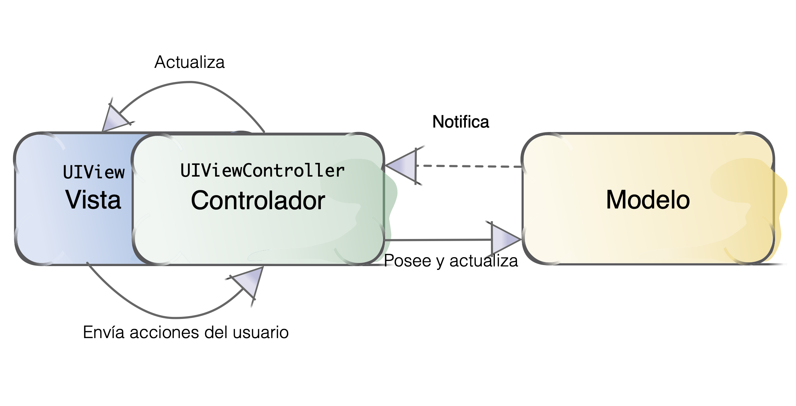
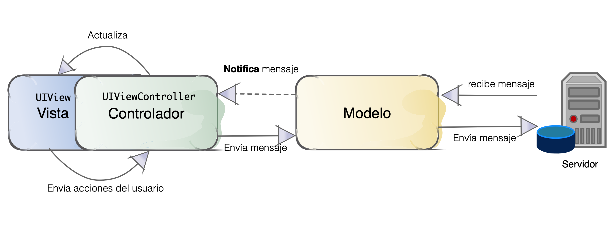
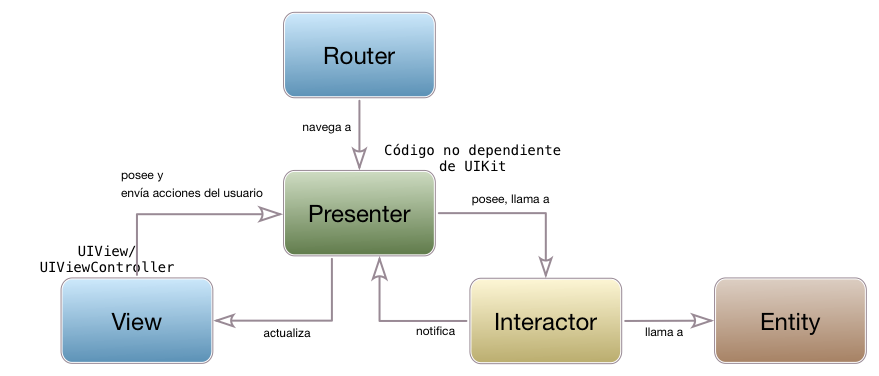
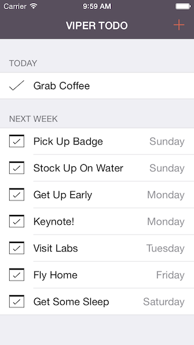

<!-- .slide: class="titulo" -->
# Arquitecturas de aplicaciones iOS. **Parte I: MVC y alternativas**


---


<!-- .slide: data-background-image="img/warning.png" data-background-opacity="0.25" data-background-repeat="repeat"-->

<span style="color:red; font-weight:bolder; font-size: 2em">A partir de aquí, todo es opinable</span>

---


## ¿Qué debe tener una buena arquitectura?

Entre otras cosas...

- Cada clase debe desempeñar un único papel 
- Debe facilitar el testing 
- No debe depender de un framework concreto 
- Debe ser flexible por simplicidad pero no por demasiada abstracción 
- Debe permitir seguir el flujo de datos con facilidad 

[Charla "Good iOS Application Architecture: MVVM vs. MVC vs. VIPER"](https://academy.realm.io/posts/krzysztof-zablocki-mDevCamp-ios-architecture-mvvm-mvc-viper/
) <!-- .element: class="caption" -->


---

## Puntos a tratar

- **Problemas de MVC/posibles soluciones**
- Alternativa: MVVM
- Alternativa: VIPER


---

## Algunos problemas de MVC

1. Acoplamiento entre componentes
2. Massive View Controllers
3. Navegación entre pantallas


---

## Acoplamiento entre componentes
## MVC en la teoría

- Los componentes están *desacoplados*


---

## Problema 1: Acoplamiento entre componentes

Por el propio diseño de iOS hay un acoplamiento vista/controlador

<!-- .element class="stretch" -->

Este problema lo resuelven otras arquitecturas como MVVM, pero en iOS MVC digamos que "se tolera"

---

## Evitar acoplamiento modelo/controlador

En una hipotética *app* de chat, queremos que el modelo le comunique al controlador que se ha recibido un mensaje, pero sin acoplamiento



---

## Notificaciones


Permiten comunicar componentes sin acoplamiento

```swift
//El view controller
class MiViewController : UIViewController {
    let miChatModel : ChatModel!

    func viewDidLoad() {
        miChatModel = ChatModel()
        NotificationCenter.default.addObserver(self, selector:#selector(self.mensajeRecibido), name:Notification.Name("mensaje_recibido"), object: nil)
    }

    @objc func mensajeRecibido(notif : Notification) {
        ...
    }
}
```

---

## Notificaciones


Permiten comunicar componentes sin acoplamiento

```swift
//El modelo
//No tiene ninguna referencia al controller ni a la vista
class ChatModel {
    //a esta función se llamaría cuando se recibiera un mensaje del servidor
    //el cómo en concreto depende de la tecnología usada (Websockets, Server Sent Events, ...)
    func mensajeRecibidoDelServidor(texto : String) {
        NotificationCenter.default.post(name: Notification.Name("mensaje_recibido"), object: nil, userInfo: ["mensaje":texto])
    }
}
```

---

## Problema 2: Massive View Controllers

- Los *view controllers* técnicamente son el pegamento que une la vista (componentes de UI) con el modelo 


- Deberían contener solo el código estrictamente necesario para
    + Que cuando se pulse un botón "pase algo" en el modelo
    + Que cuando "pasa algo" en el modelo se actualice la interfaz
    
**PERO...**

---

## Problema 2: Massive View Controllers

- Cuando un desarrollador iOS no sabe dónde poner una cosa, la pone en el ViewController
- Lo hemos hecho muchísimas veces en los ejemplos de clase 🙄

<div class="column half">
    
</div>
<div class="column half">    

</div>

---

## Responsabilidades "típicas" de un Controller real

- Pegamento entre vista y modelo
- DataSource de tablas y otros componentes (UIPicker)
- Delegate de tablas y otros
- Cliente de APIs externos
- Recupera/Guarda datos en Core Data
- ...


---

## Solución: refactorizar el código en clases adicionales

Ejemplo de aplicación en la que "todo lo hace el view controller"

- [Código del *view controller*](https://github.com/ottocol/mvc-refactor-swift/blob/v1.0/ListaCompra/ListaViewController.swift)
- [Fuente de la *app* en Github](https://github.com/ottocol/mvc-refactor-swift/) (versión actual ya refactorizado)


---


Para más detalles, podéis ver la charla: "*Refactoring tne Mega Controller*", de Andy Matuschak (**¡Muy recomendable!**)

- [Video de la charla](https://vimeo.com/140037432)
- [Código de ejemplo en Github](https://github.com/andymatuschak/refactor-the-mega-controller)


---

## Problema 3: MVC no es una arquitectura para toda la *app*

MVC cubre "una pantalla", pero ¿qué pasa al cambiar de una pantalla a otra?
- Ya hemos visto que necesitamos pasar datos de un `ViewController` a otro
- Además necesitamos saber a qué pantallas se puede ir desde una dada, y cómo 

---

## Pasar datos entre controllers

+ *Singleton*
+ Inyección de dependencias

---

## Singleton

La versión "civilizada" de la variable global. Omnipresente en iOS (*app delegate*, *notification center*, cola principal, preferencias de usuario,...) 

```swift
//Definición
class StateSingleton {
    var pedidoActual:Pedido!
    
    private init(){
    }
    
    static let shared = StateSingleton()
}
```
```swift
//Uso
StateSingleton.shared.pedidoActual
```

---

## Inyección de dependencias

La hemos usado varias veces

```swift
//En el view controller 1
override func prepare(for segue: UIStoryboardSegue, sender: Any?) {
    if segue.identifier=="siguiente" {
        if let vc2 = segue.destination as? ViewController2 {
            vc2.mensaje = "Bienvenidos a la pantalla 2"
        }
    }
 }
```
```swift
//En el view controller 2
class ViewController2 : UIViewController {
    var mensaje : String!
    ...
}
```
Problema: no tenemos ninguna ayuda del compilador para asegurarnos de que estamos pasando los datos 

---

Desde iOS13 *segue action*, un método que iOS llama durante la transición de un *segue* para que podamos crear nosotros el view controller, en vez de crearlo iOS. Nos permite usar un *inicializador a medida*, **cuyo uso correcto chequea el compilador**

```swift
@IBSegueAction
private func showPreview(coder: NSCoder)
    -> ViewController2? {
    return ViewController2(coder: coder, mensaje: "hola")
}
```

```swift
import UIKit
class ViewController2: UIViewController {
  let mensaje: Mensaje

  init?(coder: NSCoder, mensaje: texto) {
    self.mensaje = texto
    super.init(coder: coder)
  }
  ...
}
```

Más detalles por ejemplo en [Better Storyboards  with Xcode 11](https://useyourloaf.com/blog/better-storyboards-with-xcode-11/)

---

## Flujo de navegación

¿Cómo especificar el flujo de navegación entre pantallas de forma que sea fácil de entender, escalable y compatible con la gestión de versiones?

- *Storyboards* 
    - Problemas de escalabilidad. Mejor dividir el storyboard en fragmentos con *storyboard references* ([tutorial ejemplo](https://cocoacasts.com/organizing-storyboards-with-storyboard-references))
    - Al ser XML generado automáticamente plantean [problemas con el control de versiones](https://martiancraft.com/blog/2018/02/handling-storyboard-merge-conflicts/)
- Arquitecturas como VIPER (entre otras) intentan solucionar este problema


---

## Puntos a tratar

- Problemas de MVC/posibles soluciones
- **Alternativa: MVVM**
- Alternativa: VIPER

---

## MVVM (Model/View/ViewModel)

 <!-- .element class="stretch"-->

La parte "nueva" es el *viewmodel*, que se encarga de la *lógica de presentación*, es decir convertir/modificar/formatear datos (p. ej. fechas, distancias, ...) en el formato adecuado para la vista

A cambio se elimina el *controller*

---

## UAdivino versión MVVM

- Repo Github: [https://github.com/ottocol/UAdivino_MVVM_Combine](https://github.com/ottocol/UAdivino_MVVM_Combine)

---

## Más sobre la vista

 <!-- .element class="stretch"-->

- Lo mismo que era en MVC, pero...
- Aunque pueda parecer un poco raro, un "view controller" de iOS también se considera vista

---

## Por qué un ViewController debería ser vista

- Al estar el ciclo de vida del "view controller" y de los elementos de interfaz tan unidos, es mejor considerarlos a todos como vista
- Además conseguimos que la vista sea el único componente directamente dependiente de la tecnología de presentación, en iOS `UIKit`

---

## Más sobre el viewmodel

 <!-- .element class="stretch"-->

* El *viewmodel* es la representación de los datos de la vista pero independiente de la tecnología de interfaz de usuario (en iOS: no hay un `import UIKit`)
* **bindings entre viewmodel y vista** Cuando cambia un "lado", el otro lo hace también automáticamente

---


## Ensamblando Vista/ViewModel/Modelo

- Recordar que el *view controller* es parte de la vista. En él definimos
```swift
class UAdivinoView : UIViewController { 
   let viewModel = UAdivinoViewModel()
   ...
}
```

- En el view model
```swift
class UAdivinoViewModel {
   let model = UAdivinoModel()
   ...
}
```

---

## *Bindings*

- Desde 2019 en iOS tenemos `Combine`, que es un *framework* de **programación funcional reactiva**
- Según Apple: "Combine is a framework to customize handling of asynchronous events by combining event-processing operators" 🤯 
- Hay alternativas de terceros: ReactiveCocoa, RxSwift, Bond ...

---

## *Data binding* en Combine

- Se pueden vincular propiedades de componentes de UI en la vista (`miLabel.textColor`, `miLabel.text`,...) con *publishers* en el viewmodel. 
- **publisher** es un concepto tomado de la *programación funcional reactiva* (también llamados *observables*, streams*, *signals*,...)
- Un publisher emite algo similar a un evento. Uno o más subscribers (similares a *listeners*), reciben los cambios en el valor del publisher
- La parte de programación funcional es la que nos permite transformar/manipular/combinar los observables

---

## Publisher

- Son las propiedades del *ViewModel* cuyos cambios queremos recibir

```swift
@Published var nombre : String 
```

---

## *Binding* del publisher

- Lo más típico es vincular el publisher con una propiedad de un control de `UIKit`. 

```swift
//Estamos en la vista, necesitamos una referencia al view model
//suponemos además un outlet en la vista que representa un "label": labelOutlet
viewModel.$nombre.assign(to:\.text, on:labelOutlet)
```

---

## Cuestión de implementación

- Para que el *binding* tenga efecto debe estar "vivo", tenemos que guardarlo en una variable que no se salga del ámbito

```swift
//En la vista
class MiVista : UIViewController {
   var binding : AnyCancellable!
   let viewModel = ViewModel()
   ...
   override func viewDidLoad() {
      binding = viewModel.$nombre.assign(to:\.text, on:labelOutlet)
   }
}
```


---


## Binding del texto de la respuesta en la aplicación UAdivino


- [Viewmodel](https://github.com/ottocol/UAdivino_MVVM_Combine/blob/main/ViewModel/UAdivinoViewModel.swift)
- [Vista](https://github.com/ottocol/UAdivino_MVVM_Combine/blob/main/ViewModel/UAdivinoView.swift)

---

## Problema con el color de la respuesta

- No podemos vincular directamente la propiedad `colorResp` del *viewmodel* con la propiedad `textColor` del label de la respuesta, ya que la primera es de un tipo enumerado propio y la segunda es `UIColor`, la forma estándar de representar un color en `UIKit`

**¿Qué hacemos?** 🤔


---

## Transformar los observables

- Programación **Funcional** Reactiva: aplicando primitivas típicas de programación funcional, podemos transformar los valores que "emite" un publisher

```swift
//En la vista
self.viewModel.$colorResp
    //con esto filtramos todos los valores que no sean verde o rojo
    .filter {
        color in
        return (color == .verde || color == .rojo) ? true : false
    }
    //con esto transformamos valores de enumerado a UIColor
    .map {
       color in
       return (color == .verde ? UIColor.green : UIColor.red)
    }
    //Ahora ya podemos hacer el binding
    .assign(to: \.textColor, on: labelRespuesta)
```

[Código de UAdivino MVVM](https://github.com/ottocol/UAdivino_MVVM_Combine/blob/253572157fa3e105015dbce248cadae19779b972/ViewModel/UAdivinoView.swift#L29-L32)

---

## Puntos a tratar

- Problemas de MVC/posibles soluciones
- Alternativa: MVVM
- **Alternativa: VIPER**


---

## VIPER

- "Un paso más", ya que ninguna arquitectura MVx
    + Detalla cómo estructurar el modelo
    + Habla sobre navegación (cambio de pantallas)
- Adaptación de la Clean Architecture de "Uncle" Bob Martin


---


- [https://8thlight.com/blog/uncle-bob/2012/08/13/the-clean-architecture.html](https://8thlight.com/blog/uncle-bob/2012/08/13/the-clean-architecture.html)

---

## VIPER

- View, Interactor, Presenter, Entity, Router 
- [https://www.objc.io/issues/13-architecture/viper/](https://www.objc.io/issues/13-architecture/viper/)



---

## Principios básicos que subyacen a VIPER

- Single Responsibility
- "Program to interfaces, not implementations"
- Dependency inversion

---

## Problema fundamental de VIPER

- Demasiada "infraestructura": por cada caso de uso o módulo
    + 5 componentes (V, I, P, E, R)
    + 2 interfaces por componente

- Generadores de plantillas VIPER
    + https://github.com/pepibumur/viper-module-generator
    + https://github.com/rambler-digital-solutions/Generamba
    + https://github.com/ferranabello/Viperit

---

## VIPER "en acción"

- La app de ejemplo original (ahora en Swift) [https://github.com/mutualmobile/VIPER-SWIFT](https://github.com/mutualmobile/VIPER-SWIFT)



---


## ¿Alguna pregunta? 🥵
