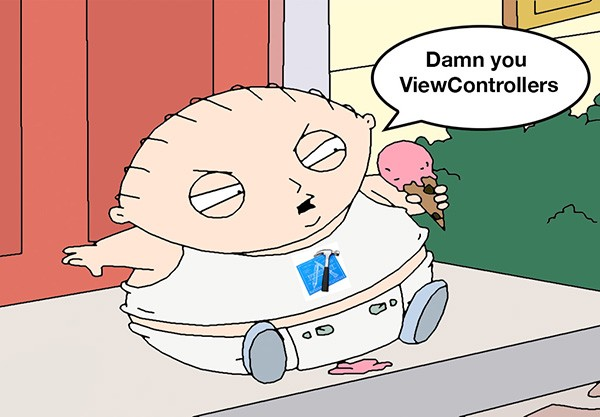

<!-- .slide: class="titulo" -->
# Arquitecturas de aplicaciones iOS. **Parte I: MVC**
## Persistencia en dispositivos móviles


---

## Puntos a tratar

- **Arquitecturas de aplicaciones iOS**
- Los problemas de MVC

---

Hasta ahora nos hemos preocupado por APIs y tecnologías, pero no demasiado por cómo **estructurar el código de la aplicación**

---

## ¿Qué debe tener una buena arquitectura?

Entre otras cosas...

- Cada clase debe desempeñar un único papel <!-- .element: class="fragment" -->
- Debe facilitar el testing <!-- .element: class="fragment" -->
- No debe depender de un framework concreto <!-- .element: class="fragment" -->
- Debe ser flexible por simplicidad pero no por demasiada abstracción <!-- .element: class="fragment" -->
- Debe permitir seguir el flujo de datos con facilidad <!-- .element: class="fragment" -->

[Charla "Good iOS Application Architecture: MVVM vs. MVC vs. VIPER"](https://academy.realm.io/posts/krzysztof-zablocki-mDevCamp-ios-architecture-mvvm-mvc-viper/
) <!-- .element: class="fragment caption" -->


---

## Puntos a tratar

- Arquitecturas de aplicaciones iOS
- **Los problemas de MVC**

---

## MVC en la teoría


---

## Problema 1: Acoplamiento entre componentes

Por el propio diseño de iOS hay un acoplamiento vista/controlador


Este problema lo resuelven otras arquitecturas como MVVM/MVP

---

## Evitar acoplamiento entre modelo y controlador

El controlador puede guardar referencias al modelo

```swift
class MiViewController : ViewController {
    var miModelo : Modelo
    ...
}
```

pero no al revés, ya que **el modelo no sería reutilizable**

```swift
class Modelo  {
    //NOOOOOOOOOOO!!!!!
    var mc : MiViewController
    ...
}
```

---

Recordad que en iOS hay dos mecanismos básicos que podemos usar para independizar el modelo del controlador:

- KVO
- Notificaciones

El controlador siempre debe **escuchar al modelo**, no el modelo enviarle específicamente los datos al controlador

---

## Problema 2: Massive View Controllers


<div class="column half">
    
</div>
<div class="column half">    

</div>


---

Ejemplo de aplicación en la que "todo lo hace el view controller"

- [Fuente de la *app* en Github](https://github.com/ottocol/mvc-refactor-swift/) (versión actual ya refactorizado)
- [Código del *view controller*](https://github.com/ottocol/mvc-refactor-swift/blob/v1.0/ListaCompra/ListaViewController.swift)

---

## ¿Qué funciones está haciendo aquí el controller?


---

## Vamos a refactorizar el *view controller* para que no realice tantas tareas distintas


---

<!-- .slide: data-background-image="https://www.mycustomer.com/sites/default/files/styles/banner/public/warning_0_0_0_0_1_0_0.jpg" -->

<span style="color:red; font-weight:bolder; font-size: 2em">A partir de aquí, todo es opinable</span>

---

## Fuentes

- Principios básicos de programación
- Patrones de diseño
- "Sentido común"

---


### **Principio de Responsabilidad Única**: una clase debería tener solo una razón para cambiar

Nuestro *view controller* debe cambiar si cambia:

- La agrupación de las tareas en categorías
- El almacenamiento (p.ej. guardarlo como JSON, o como preferencias)
- La representación de los datos en la tabla
- ...

Otro principio similar: separación de intereses (*separation of concerns*)

---

## Cambios a realizar

* Encapsular la lógica en un **modelo** 
*  Encapsular la persistencia en un **repositorio** (también llamado DAO, *data mapper*, ...)
    * Además de separar responsabilidades, facilita el cambio en el mecanismo de persistencia (¿preferencias?, ¿SQLite?)
* Separar la responsabilidad de actuar como **datasource**
* Extraer el código que **configura las celdas**

---

## Encapsular la persistencia

Ya vimos un ejemplo en la sesión de SQLite

```swift
class DBManager {
    var db : OpaquePointer? = nil
    
    init(conDB nombreDB : String) {
        ...
    }

    func listarTareas() -> [Tarea] {
        ...
    }
```

---

## Encapsular la persistencia en una *app* con Core Data

Es más complicado, ya que Core Data mezcla **modelo** (entidades) y **persistencia**. Las entidades están íntimamente ligadas al contexto de persistencia

```swift
let u = Usuario(context:miContexto)
```

No es un problema tan grande, porque...

<ul>
<li class="fragment">El API de persistencia es suficientemente sencillo como para "no molestar"</li>
<li class="fragment">En una *app* con Core Data raramente cambiaremos de API de persistencia</li>
</ul>

---

## No obstante, si nos empeñáramos...


Los **Data Transfer Objects** (DTOs) son copias de las entidades, pero sin estar vinculados a ningún contexto de persistencia ([patrón de diseño](https://martinfowler.com/eaaCatalog/dataTransferObject.html) típico de *apps enterprise*)

Así, tendríamos una clase `UsuarioDTO` y una clase `Usuario` que sería la entidad de Core Data. Nuestro código trabajaría solo con la primera, la segunda la vería solo el repositorio

---

## Separar el Datasource del ViewController

- [ListaCompraDataSource](https://github.com/ottocol/mvc-refactor-swift/blob/master/ListaCompra/ListaCompraDataSource.swift)
- [ListaViewController](https://github.com/ottocol/mvc-refactor-swift/blob/master/ListaCompra/ListaViewController.swift)

---

## Separar la celda del DataSource

Siendo puristas, una celda es parte de la *vista*, por lo que aquí estamos mezclando responsabilidades

```swift
func tableView(_ tableView: UITableView, cellForRowAt indexPath: IndexPath) -> UITableViewCell {
        let celda = tableView.dequeueReusableCell(withIdentifier: "MiCelda", for: indexPath)
        if let prioridad = Prioridad(rawValue: indexPath.section),
            let item = lista.getItem(pos: indexPath.row, prioridad: prioridad) {
            celda.textLabel?.text = item.nombre
            if item.comprado {
                celda.accessoryType = .checkmark
            }
            else {
                celda.accessoryType = .none
            }
        }
        return celda
}
```

---

## Encapsular la celda en su propia clase

```swift
class CeldaItem : UITableViewCell {
    static let nombre = "MiCelda"
    
    var nombre : String? {
        didSet {
            self.textLabel?.text = self.nombre
        }
    }
    
    var comprado : Bool? {
        didSet {
            self.accessoryType = self.comprado! ? .checkmark : .none
        }
    }
}
```
[CeldaItem.swift](https://github.com/ottocol/mvc-refactor-swift/blob/master/ListaCompra/vista/CeldaItem.swift) <!-- .element: class="caption" -->

---


Para más detalles, podéis ver la charla: "*Refactoring tne Mega Controller*", de Andy Matuschak (**¡Muy recomendable!**)

- [Video de la charla](https://vimeo.com/140037432)
- [Código de ejemplo en Github](https://github.com/andymatuschak/refactor-the-mega-controller)


---

## Problema 3: MVC no es una arquitectura para toda la *app*

- MVC cubre "una pantalla", pero ¿cómo cambiamos de una pantalla a otra?
- Arquitecturas como VIPER intentan solucionar este problema (y otros como el de la dependencia de *frameworks* concretos)


---

# ¿Alguna pregunta?