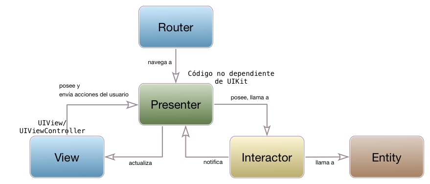

<!-- .slide: class="titulo" -->
# Arquitecturas de *apps* iOS. Parte II: **Alternativas a MVC**

---

## Puntos a tratar

- **MVVM (Model/View/ViewModel)**
- VIPER

---

## MVVM (Model/View/ViewModel)


- El *viewmodel* se encarga de la *lógica de presentación*, es decir convertir/modificar/formatear datos (p. ej. fechas, distancias, ...) en el formato adecuado para la vista
  - El *viewmodel* es independiente de la tecnología de la vista (no hay un `import UIKit`)
  - Hay ***bindings* automáticos entre las propiedades del *viewmodel* y las de la vista**. Cuando cambia un "lado", el otro lo hace también automáticamente

---

## ¿Qué es la vista en MVVM?

- Lo mismo que era en MVC, pero...
- Aunque pueda parecer un poco raro, un "view controller" de iOS también se considera vista

---

 <!-- .slide: data-background-image="http://www.thebrokeagent.com/sitemain/wp-content/uploads/2016/12/are-you-serious-wtf-meme-baby-face.jpg" -->

---

- Al estar el ciclo de vida del "view controller" y de los elementos de interfaz tan unidos, es mejor considerarlos a todos como vista

- Además conseguimos que la vista sea el único componente directamente dependiente de la tecnología de presentación, en iOS `UIKit`

---

## *Bindings*

- Necesitamos alguna librería/*framework* que implemente estos *bindings*, ya que en iOS no existen de forma nativa
- Aquí usaremos una librería llamada [Bond](https://github.com/ReactiveKit/Bond), (Swift Bond, :) ). Hay otras alternativas: ReactiveCocoa, RxSwift, ...

---

## *Data binding* en Bond

- Se pueden vincular *observables*. Es un concepto tomado de la *programación funcional reactiva* (también llamados *streams*, *signals*,...)
- Los observables son similares a los eventos. Uno o más observadores (similares a *listeners*), reciben los cambios en el valor del observable
- La parte de programación funcional es la que nos permite transformar/manipular/combinar los observables

---

## Observables en Bond

- En el *ViewModel* podemos crear un observable del tipo necesario

```swift
var obs = Observable<String>("")
```

- `obs` no es un `String`, sino un observable. El `String` está en `obs.value`

```swift
obs.value = "un nuevo valor"
```

---

## *Binding* del observable

- Lo más típico es vincular el observable con una propiedad de un control de `UIKit`. Bond extiende los controles con una propiedad `reactive`, y dentro de ella los campos habituales del control (`text`, `textColor`,...) pero en versión *observable*

```swift
//suponemos un outlet en la vista que representa un "label": labelOutlet
viewModel.obs.bind(to:self.labelOutlet.reactive.text)
```

---

## UAdivino versión MVVM 

- Repo Github: [https://github.com/ottocol/ejemplos-arquitectura-iOS/tree/master/MVVM/UAdivino](https://github.com/ottocol/ejemplos-arquitectura-iOS/tree/master/MVVM/UAdivino)

---

## Ensamblando Vista/ViewModel/Modelo

- Recordar que el *view controller* es parte de la vista. En él definimos

```swift
class UAdivinoView : UIViewController { 
  let viewModel = UAdivinoViewModel()
  ...
}
```


- En el view model


```swift
class UAdivinoViewModel {
  let model = UAdivinoModel()
  ...
}
```

---

## Mostrar el texto de la respuesta en la vista

- En el view model

```swift
let textoResp = Observable<String>("")
...
let resp = model.obtenerRespuesta()
textoResp.value = resp.texto
```

- En la vista

```swift
override func viewDidLoad() {
    self.viewModel.textoResp.bind(to:self.respuestaLabel.reactive.text)
}
```

---

## Cambiar el color de la respuesta en la vista


- Problema: En el *view model* el color es un enumerado, en la vista un `UIColor`. No podemos vincular ambos directamente
- Tampoco deberíamos usar `UIColor` en el *view model*, para preservar la independencia de `UIKit`

¿Y ahora qué?

---

## Transformar los observables

- **Programación Funcional Reactiva**: aplicando primitivas típicas de programación funcional, podemos transformar los valores que "emite" un observable

```swift
//En la vista
self.viewModel.colorResp
    .filter {
        color in
        return (color != .verde && color != .rojo) ? false : true
    }
    .map {
       color in
       return (color == .verde ? UIColor.green : UIColor.red)
    }
    .bind(to: self.labelRespuesta.reactive.textColor)
```


---

## Puntos a tratar

- MVVM (Model/View/ViewModel)
- **VIPER**

---

## VIPER

- "Un paso más", ya que ninguna arquitectura MVx
    + Detalla cómo estructurar el modelo
    + Habla sobre navegación (cambio de pantallas)
- Adaptación de la Clean Architecture de "Uncle" Bob Martin


---


- [https://8thlight.com/blog/uncle-bob/2012/08/13/the-clean-architecture.html](https://8thlight.com/blog/uncle-bob/2012/08/13/the-clean-architecture.html)

---

## VIPER

- View, Interactor, Presenter, Entity, Router 
- [https://www.objc.io/issues/13-architecture/viper/](https://www.objc.io/issues/13-architecture/viper/)



---

## Principios básicos que subyacen a VIPER

- Single Responsibility
- "Program to interfaces, not implementations"
- Dependency inversion

---

## Programar contra interfaces, no contra implementaciones


---

## Dependency Inversion

- El código más abstracto no debería depender del más "concreto"


---

## Navegación en VIPER

- El *Router* (también llamado *wireframe*) se encarga, a requisito del *presenter*, de cambiar de "pantalla". Normalmente no se usan los *segues* del *storyboard*

[https://speakerdeck.com/sergigracia/clean-architecture-viper](https://speakerdeck.com/sergigracia/clean-architecture-viper)<!-- .element style="font-size:0.5em" -->


---

## Comunicación entre componentes

- Aunque resulta tentador pasar las entidades, no se recomienda para evitar acoplamiento. Pasar `structs` entre componentes, o datos simples.


---

---

## Problema fundamental de VIPER

- Demasiada "infraestructura": por cada caso de uso o módulo
    + 5 componentes (V, I, P, E, R)
    + 2 interfaces por componente

- Generadores de plantillas VIPER
    + https://github.com/pepibumur/viper-module-generator
    + https://github.com/rambler-digital-solutions/Generamba
    + https://github.com/ferranabello/Viperit

---

## VIPER "en acción"

- La app de ejemplo original (ahora en Swift) [https://github.com/mutualmobile/VIPER-SWIFT](https://github.com/mutualmobile/VIPER-SWIFT)


---

## Más referencias sobre arquitecturas en iOS

La "lista maestra": [https://github.com/onmyway133/fantastic-ios-architecture](https://github.com/onmyway133/fantastic-ios-architecture)

---

# ¿Alguna pregunta?