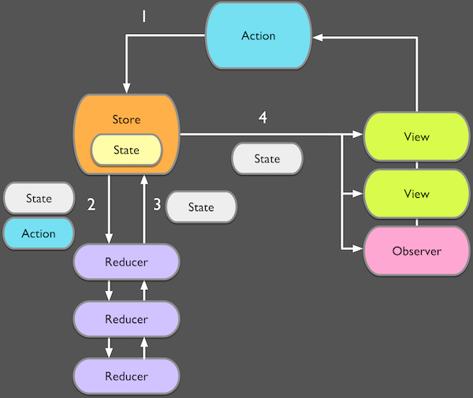

<!-- .slide: class="titulo" -->
# Arquitecturas de aplicaciones iOS. **Parte III: Redux**

---

## ¿Qué es Redux?

Una arquitectura para **gestionar el estado** en las aplicaciones que pretende conseguir un **flujo de datos unidireccional** y predecible, y por tanto fácil de seguir


---

## Orígenes de Redux

Viene del mundo del desarrollo de aplicaciones web

- **La arquitectura Elm** (2012): Elm es un lenguaje específico para clientes web que transpila a Javascript
- **Flux** (2014): arquitectura propuesta por Facebook  para estructurar aplicaciones con su *framework* web React
- **Redux** (2015): la variante de Flux que ha tenido mayor éxito, transportada luego a otros *frameworks* web

---

 <!-- .element: class="stretch" -->


---

Vamos a usar un *framework* llamado [ReSwift](https://github.com/ReSwift/ReSwift) 

No es tan esencial usar un *framework*, la implementación original de Redux en JS ocupa < 150 LOC (ReSwift tiene unas 1300)

---

## El Store

- El estado de la aplicación se guarda en el `Store`. Es simplemente un `struct` con datos

- Debe ser accesible desde toda la *app*

- El `Store` se puede leer pero no modificar directamente, para modificarlo hay que despacharle una `Action`

---

## En ReSwift

- El estado es un `struct` conforme al protocolo `StateType`

```swift
//supongamos una app con la lists de la compra
struct AppState : StateType {
   var items = [Item]()
   var usuario : Usuario!
}
```

- El `Store` se declara con el tipo del estado, el *reducer* principal (que luego veremos) y el estado inicial

```swift
let store = Store<AppState>(reducer: appReducer, state: nil)
```

---

## 1. La vista despacha acciones

- Típicamente cuando el usuario interactúa con la interfaz
- Las acciones modifican el estado en el `Store`
- En el código
    + una acción no es más que un `struct` que encapsula el cambio en el estado
    + Por cada acción distinta definimos un `struct` conforme al protocolo

---

## Acciones en ReSwift

```swift
import ReSwift

struct AddItem : Action {
    let nuevo : Item
}

struct DeleteItem : Action {
    let id : Int
}
```

---

## 2. La acción es procesada por el *middleware*

Funciones que añaden funcionalidades adicionales a las básicas de *redux*. Veremos alguna luego

---

## 3. La acción es procesada por los *reducer*

Un *reducer* no es más que una función con la signatura

```swift
(Action, State) -> State
```

---

En código un *reducer* es básicamente un *switch* que en función de la acción ejecuta el cambio en el estado

```swift
func appReducer(action: Action, state: AppState?) -> AppState {
    //si no hay estado, lo inicializamos
    var state = state ?? AppState()

    switch action {
        case let action as AddItem:
            state.items.append(action.nuevo)
        case let action as DeleteItem:
            ...
        default:
            break
    }

    return state
}
```

---

## Root reducer

El *reducer* principal, o *root reducer*, puede llamar a otros *reducers*, y cada uno encargarse de una parte del estado

```swift
func appReducer(action: Action, state: State?) -> State {
    return State(
      navigationState: navigationReducer(action, state?.navigationState),
      authenticationState: authenticationReducer(action, state?.authenticationState),
      repositories: repositoriesReducer(action, state?.repositories),
      bookmarks: bookmarksReducer(action, state?.bookmarks)
   )
}
```

---

## 4. Los objetos suscritos al Store reciben el nuevo estado

Típicamente el `ViewController`. El nuevo estado es recibido y mostrado en la vista

---

## Suscripción al Store en ReSwift

- El suscriptor debe ser conforme al protocolo `StoreSubscriber`
- El store avisará llamando al método `newState`

---

## Acciones asíncronas

- Todo lo anterior es válido para acciones síncronas, pero por ejemplo la comunicación con APIs externos será asíncrona, ¿cómo implementarlo?

- *Thunk*: es una acción que en lugar de ser datos es código Swift. Esta acción puede acceder al estado actual y despachar acciones síncronas 

- En `ReSwift`, extensión [ReSwift-Thunk](https://github.com/ReSwift/ReSwift-Thunk) (misma idea que [redux-thunk](https://github.com/reduxjs/redux-thunk), pero en Swift en lugar de JS)


---

## Ejemplo de Thunk

```swift
let thunk = Thunk<MyState> { dispatch, getState in 
    if getState!.loading {
        return
    }
    dispatch(RequestStart())
    api.getSomething() { something in
        if something != nil {
            dispatch(RequestSuccess(something))
        } else {
            dispatch(RequestError())
        }
    }
}

```

---


# ¿Alguna pregunta?