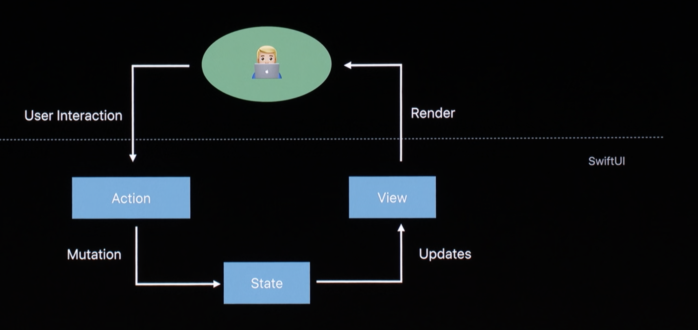
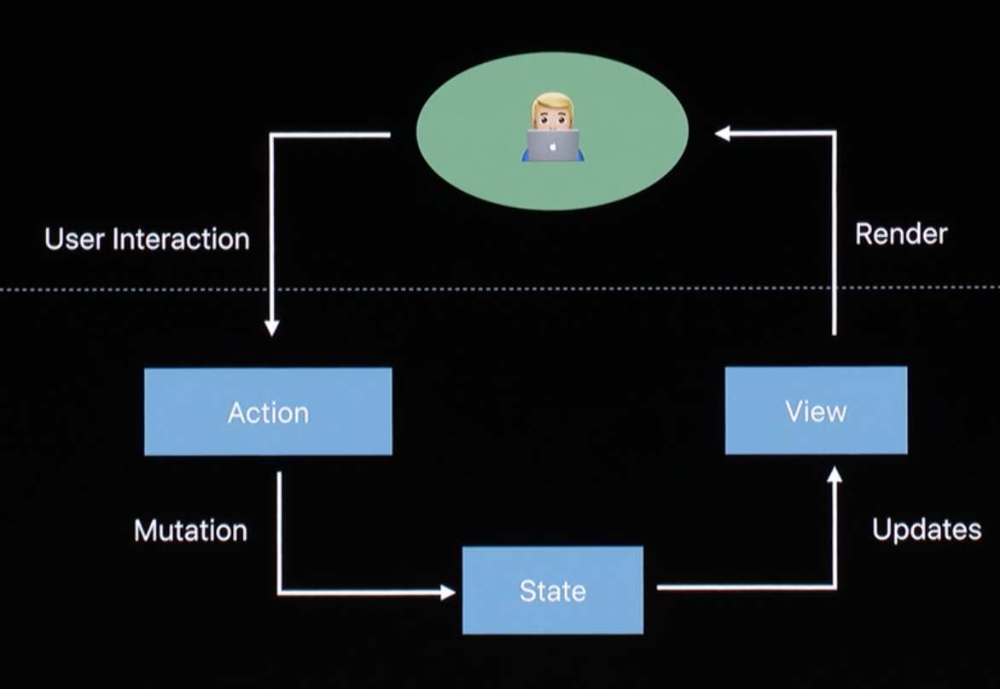
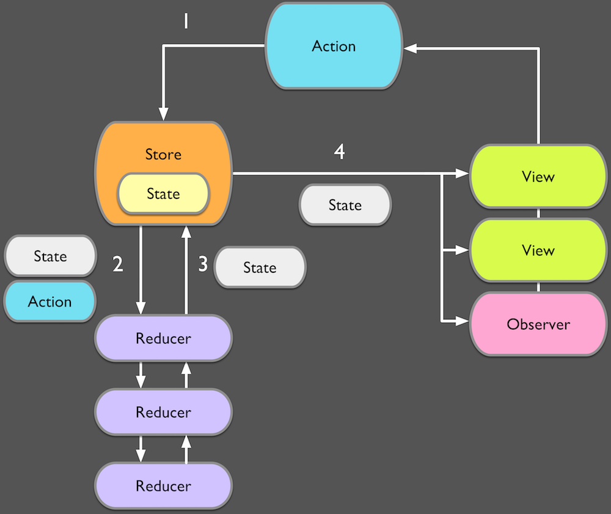

<!-- .slide: class="titulo" -->
# Arquitecturas de aplicaciones iOS. **Parte IV: SwiftUI**

---

## Contenidos

- **Introducción a SwiftUI**
- Componentes 
- Componentes con estado. Bindings

---

## ¿Qué es SwiftUI?

- Un *framework* de Apple para la creación de interfaces de usuario en aplicaciones iOS/MacOS/watchOS
- Presentado en la WWDC 2019
- Probablemente sustituirá a medio/largo plazo UIKit/AppKit (👋), los *frameworks* actuales para UI
- SwiftUI no solo es una biblioteca de componentes de usuario, también es una nuevas forma de estructurar aplicaciones y gestionar la relación entre el modelo y la vista.  
- Los que hayáis programado en React y en menor medida en Vue/Angular encontraréis bastantes ideas familiares


---


## Características de SwiftUI

- Es **declarativo**
- Basado en una **jerarquía de componentes**
- **La interfaz se actualiza automáticamente** cuando cambian los datos (similar a MVP)
- Herramientas de **previsualización en tiempo real** (requiere Catalina)


---

## Declarativo vs. imperativo

- En UIKit se especifican y combinan los componentes de modo *imperativo*

```swift
//En el viewDidLoad() de un view controller
let boton = UIButton()
boton.backgroundColor = UIColor.red
self.view.addSubview(boton)
```

- SwiftUI es *declarativo*. Se especifica qué se debe ver en la interfaz

```swift
//"verAlert" es una propiedad del componente. Ya veremos cómo se define
Text("Intro a SwiftUI")
Button("Saludar") {
    self.verAlert = true
}
.alert(isPresented: $verAlert) {
  Alert(title: Text("Hola SwiftUI!"), message: Text("SwiftUI es lo más"), dismissButton: .default(Text("Aceptar")))
}
```

---

## Contenidos

- Introducción a SwiftUI
- **Componentes** 
- Componentes con estado. Bindings


---

## Componente SwiftUI

- Es un *struct* conforme al protocolo `View`
- Debe tener una propiedad calculada `body` que devuelva los *subcomponentes* que lo forman

```swift
import SwiftUI

//Esto es un componente propio
struct ContentView: View {
    var body: some View {
         //Este es un componentes "primitivo"
         Text("Hola SwiftUI")
    }
}
```

---

## Componente SwiftUI (o "vista")

Puede haber varios subcomponentes, pero deben formar un árbol con uno solo en la raíz (podemos agrupar componentes con `Group`)

```swift
import SwiftUI

//Esto es un componente propio
struct ContentView: View {
    var body: some View {
        Group {
            //Estos son componentes "primitivos"
            Text("Hola SwiftUI")
            Button("Saludo") {
                print("hola")
            }
        }
    }
}
```

---

## Modificadores

Al aplicar un modificador sobre una vista obtenemos una nueva vista

```swift
Text("Hola")
    .font(Font.system(size: 60, design: .default))
Image("paisaje")
    .resizable()
    .aspectRatio(.fit)
```

---

## Preview del componente

- La usa Xcode 11 + Catalina para previsualizar "en tiempo real"
- Le podemos pasar datos de prueba
- Podemos tener varias previsualizaciones (p.ej. modo claro vs modo oscuro)

```swift
struct ContentView_Previews: PreviewProvider {
    static var previews: some View {
        ContentView()
    }
}
```

---


## Componentes con propiedades

- Las propiedades se pueden pasar "desde fuera"
- En realidad no es más que código Swift: definir una propiedad en un *struct* y llamar al constructor por defecto del *struct* pasándole la propiedad

```swift
struct Saludo: View {
    let nombre : String
    var body: some View {
        Text("Hola \(nombre)")
    }
}
```

---

## Jerarquía de componentes

- Los componentes se pueden componer :) en una jerarquía

```swift
//Archivo "App.swift"
struct App: View {
    let nom : String = "SwiftUI"
    var body: some View {
        Group {
            Text("Ejemplo de SwiftUI")
            Saludo(nombre: nom)
        }
    }
}
```

```swift
//Archivo "Saludo.swift"
struct Saludo: View {
    let nombre : String
    var body: some View {
        Text("Hola \(nombre)")
    }
}
```

---

## Generar vistas dinámicamente

- `ForEach` devuelve una vista que encapsula un número variable de vistas

```swift
struct App: View {
    let nombres = ["Don Pepito", "Don José", "Doña Eva"]
    var body: some View {
        ForEach(0..<nombres.count) { pos in
            Saludo(nombre: self.nombres[pos])
        }
    }
}
```

---

## Iterar por colecciones

- Con `ForEach` podemos iterar por colecciones, pero cada elemento de la colección debe tener un id único

```swift
struct App: View {
    let nombres = ["Don Pepito", "Don José", "Doña Eva"]
    var body: some View {
        //indicamos que el id es el propio valor
        //Si los nombres se repitieran esto no funcionaría
        ForEach(nombres, id:\.self) { nom in
            Saludo(nombre: nom)
        }
    }
}
```
Si en lugar de `Strings` fueran tipos propios podríamos añadirle a cada uno un campo `id` con un identificador único. Podemos usar p.ej. `UUID()` para generarlo.

---

## Contenidos

- Introducción a SwiftUI
- Componentes 
- **Componentes con estado. *Bindings***

---

- Hasta ahora hemos visto que los componentes pueden tener propiedades *de lectura*, que no cambian
- Vamos a hacer que tengan propiedades que puedan cambiar, es decir **estado**

---

## Estado en SwiftUI

Propiedades marcadas con `@State`

```swift
struct Contador: View {
    @State private var valor = 0
    
    var body: some View {
        Group {
            Text("\(valor)")
            Button("Incrementar") {
                self.valor+=1
            }
        }
    }
}
```

---

- Modificar el estado hace que se **regenere automáticamente la vista**, ahora con el nuevo valor del estado
- Como resultado, **SwiftUI mantiene automáticamente y en todo momento la vista sincronizada con los datos** 😃 

---

## Binding

- Es una conexión bidireccional entre una variable de estado y un componente de la vista (si cambia uno, SwiftUI cambiará automáticamente el otro)
- Se especifica con un `$` delante del nombre de la variable
- Al ser bidireccional se asocia a componentes que permitan introducir o modificar datos (campo de texto, slider, switch, ...)

```swift
struct App: View {
    @State private var nombre = ""
    var body : some View {
        Form {
            TextField("nombre:", text: $nombre)
            Text("\(nombre)")
             .font(Font.system(size: 60, design: .default))
        }
    }
}
```

---

```swift
struct App: View {
    let ciudades = ["Sanvi", "Londres", "Paris"]
    @State private var ciudad = 0
    @State private var nombre = ""
    @State private var suscrito = false
    var body : some View {
        Form {
            Section {
                TextField("nombre:", text: $nombre)
                Picker("Lugar", selection: $ciudad) {
                    ForEach(0..<ciudades.count) { num in
                        Text("\(self.ciudades[num])")
                    }
                }.pickerStyle(WheelPickerStyle())
                Toggle("Suscribirse",isOn: $suscrito)
            }
            Section {
                Text("Hola, \(nombre) de \(ciudades[ciudad])")
                if suscrito {
                   Text("¡Gracias por suscribirte!")
                }
                else {
                   Text("¡Suscríbete, por favor!")
                }
            }
        }
    }
}
```

---

## Flujo de datos en SwiftUI

<!-- .element: class="stretch" -->


<!-- .element: class="caption" --> Tomado de la charla de la WWDC2019 [Data Flow Through SwiftUI](https://developer.apple.com/videos/play/wwdc2019/226) 


---

<div class="column half">

</div>

<div class="column half">

</div>

---

# ¿Alguna pregunta?