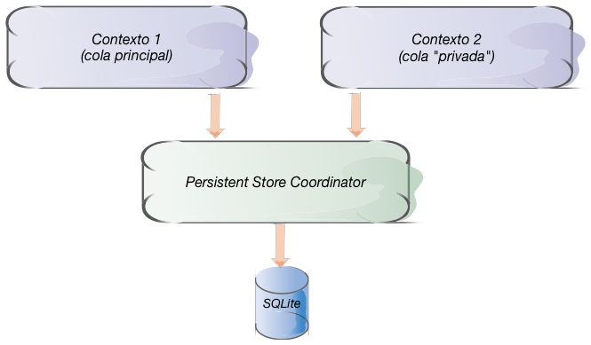
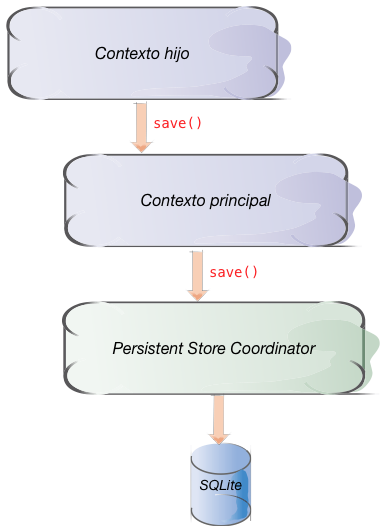

<!-- .slide: class="titulo" --> 
 
# Concurrencia y contextos múltiples en Core Data
## Persistencia en dispositivos móviles


---

## Puntos a tratar

- Qué son los contextos múltiples
- Contextos para trabajos en *background*
- Contextos anidados

---

## Puntos a tratar

- **Qué son los contextos múltiples**
- Contextos para trabajos en *background*
- Contextos anidados

---

<!-- 
Hasta ahora en todos los ejemplos hemos usado un único contexto de persistencia

```
guard let miDelegate = UIApplication.shared.delegate as? AppDelegate else {
    return
}
let miContexto = miDelegate.persistentContainer.viewContext
```

Sin embargo los APIs de Core data nos permiten [crear nuevos contextos](https://developer.apple.com/documentation/coredata/nspersistentcontainer/1640581-newbackgroundcontext) ¿para qué 🤔?

-->

## Aplicaciones que necesitan concurrencia


- En toda aplicación iOS hay un único hilo por defecto, que comparte nuestro código con la actualización de la interfaz
    + Si el código se queda bloqueado, la interfaz también
- Podemos crear más hilos para trabajos en *background*
- APIs para multihilo (de mayor a menor dificultad, menor a mayor abstracción)
    + Clase `Thread`
    + Grand Central Dispatch
    + Colas de operaciones
    

---

## Colas de operaciones

- 1 Cola = 1 hilo para ejecutar operaciones pasadas en forma de función o de clausura

```swift
let background = OperationQueue();
background.addOperation() {
    print("Comienzo mi duro trabajo...")
    print("pero yo no puedo tocar la interfaz")
    sleep(4)
    print("...terminado!")
    OperationQueue.main.addOperation() {
        print("Soy main. Desde aquí se puede actualizar la interfaz")
    }
}
```

---

## Multi-threading y Core Data

- Por desgracia ni los objetos gestionados ni el contexto de persistencia son *thread-safe*, no debemos operar con ellos desde distintos *threads*
- Solución:
   * Creamos varios contextos
   * **Cada contexto trabaja en su propio *thread***




---

## Puntos a tratar

- Qué son los contextos múltiples
- **Contextos para trabajos en *background***
- Contextos anidados

---

## Caso de uso 1: Operaciones Core data en *background*

(que no impliquen mostrar datos)

Es tan típico que desde iOS10 el `NSPersistentContainer` tiene un API especial para esto: `performBackgroundTask`

```swift
let miDelegate = UIApplication.shared.delegate as! AppDelegate
//creamos un nuevo contexto secundario y ejecutamos en él el siguiente código
miDelegate.persistentContainer.performBackgroundTask() {
   //el nuevo contexto
   contextoBG in
    let request = NSFetchRequest<Nota>(entityName: "Nota")  
    let lista = try! contextoBG.fetch(request)
    for nota in lista {
        //Aquí hacemos una operación costosa, como exportar cada nota a PDF
        //o subirlas a un servidor
        ...
    }
}
```

---

## Caso de uso 2: Operaciones en *background* que muestren datos


- Ejemplo: importar datos de un servidor. Podemos insertar los datos en un contexto en *background*, y luego guardar el contexto con `save()` 
- Si queremos mostrar los datos no podremos ya que el *thread* principal está en otro contexto, **Las  variables con los objetos gestionados no se pueden compartir entre *contextos***. Cada objeto gestionado está asociado al contexto en que "nació"

---


## Pasar objetos entre contextos sincronizando

- Cuando un contexto se guarda, emite una notificación
- Esta notificación se puede escuchar desde cualquier hilo
- El método `mergeChanges` *refresca* un contexto actualizándolo con la información contenida en la notificación


---

```swift
let miDelegate = UIApplication.shared.delegate as! AppDelegate
//El contexto principal, como hasta ahora
let miContexto = miDelegate.persistentContainer.viewContext
//Un contexto secundario
let contextoBg = miDelegate.persistentContainer.newBackgroundContext()
//El "notification center" de la aplicación
let nc = NotificationCenter.default
//Cuando el contextoBg emita una notificación de este tipo, ejecutamos el código
nc.addObserver(forName: .NSManagedObjectContextDidSave,
               object: contextoBg,
               queue: nil) {
     notificacion in
       miContexto.mergeChanges(fromContextDidSave: notificacion)
}
```


---

## Puntos a tratar

- Por qué contextos múltiples
- Contextos para trabajos en *background*
- **Contextos anidados**

---

## Contextos anidados

- Como ya hemos visto, normalmente el contexto de persistencia está conectado con el *persistent store coordinator*, y este "gestiona la BD".

- Se pueden crear contextos conectados a otros (un contexto "hijo" de otro contexto "padre"). Cuando el hijo hace `save` en realidad se lo enviamos al padre, pero hasta que este no hace `save` el objeto no se hace persistente

---



---

```swift
let contextoPadre = NSManagedObjectContext(concurrencyType: .mainQueueConcurrencyType)
//El padre está conectado a un "persistent store coordinator"
contextoPadre.persistentStoreCoordinator = ...
let contextoHijo = NSManagedObjectContext(concurrencyType: .mainQueueConcurrencyType)
//El hijo está conectado al padre
contextoHijo.parent = contextoPadre
```


---


## Contextos anidados para "modo borrador"

- Supongamos una pantalla de la *app* donde podamos hacer muchos cambios, y donde queremos que el usuario pueda cancelar
- Creamos un contexto hijo y hacemos las operaciones en él. Si el usuario le da a *guardar*, hacemos `save()` del padre. Si le da a cancelar, simplemente no hacemos nada. Se perderá el contexto hijo y con él los cambios

---

## Contextos anidados para almacenar en *background*

Alternativa al método que vimos al principio.

- Tenemos un contexto hijo en el hilo principal y el padre en uno secundario
- Trabajamos habitualmente en el contexto hijo
- Las operaciones de guardado en el hijo no serán costosas ya que `save()` del hijo solo guardará en memoria. El `save()` del padre se hace en *background* y por tanto tampoco paraliza la UI

---


# ¿Alguna pregunta?