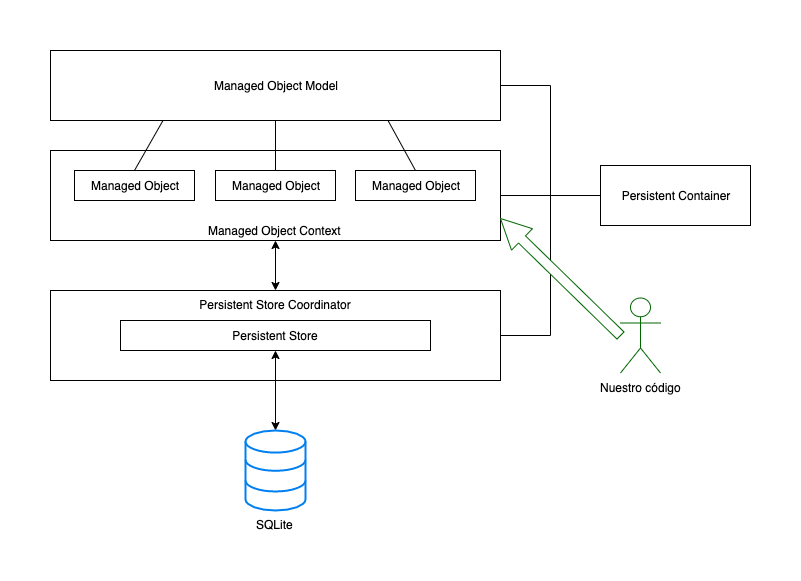

<!-- .slide: class="titulo" -->
# ¡Hola Core Data!
## Persistencia en dispositivos móviles, iOS


---

## Puntos a tratar

- **Qué es Core Data**
- El *stack* de Core Data
- Entidades
- Crear, guardar y recuperar objetos

---

## ¿Qué es Core Data?

El *framework* de persistencia de iOS. Almacena de forma **persistente los objetos de nuestra aplicación**. Es capaz de guardar un **grafo entero de objetos con sus relaciones** (uno a uno, uno a muchos, muchos a muchos) 

---

## Core Data es un ORM

- *Object Relational Mapper*, permite almacenar de forma persistente objetos en una base de datos relacional (SQLite)
- Los que hayáis usado JPA(Java), Entity Framework(.NET), Doctrine (PHP), Active Record (Ruby), ... veréis ideas muy similares (y terminología, en algunos casos)

---

## ... bueno, no, en realidad no lo es


Estrictamente hablando, **no es un ORM** ya que no soporta más que SQLite y además soporta otros almacenes de datos no relacionales (datos en memoria, archivos XML - *solo en OSX*, almacenes propios,...)

---


> Core Data is [...] capable of dealing with large volumes of data. The SQLite store can scale to terabyte sized databases with billions of rows/tables/columns. [...] 10,000 objects is considered to be a fairly small size for a data set.

> For a very simple application it is certainly the case that Core Data adds some overhead [...], however, [...] supports undo and redo, validation, object graph maintenance, and provides the ability to save objects to a persistent store. If you implemented this functionality yourself, it is quite likely that the overhead would exceed that imposed by Core Data.

[Core Data Performance, Apple Developer Docs](https://developer.apple.com/library/archive/documentation/Cocoa/Conceptual/CoreData/Performance.html)

---

## Puntos a tratar

- Qué es Core Data
- **El *stack* de Core Data**
- Entidades
- Crear, guardar y recuperar objetos


---



---

## Inicializar el *stack*

Para trabajar con Core Data necesitamos inicializar todas estas clases. Si al crear un nuevo proyecto marcamos la casilla `Use Core Data`, Xcode insertará código que lo hace por nosotros

A partir de iOS10 el código es muy sencillo, se include en el *delegate*, y usa la clase `NSPersistentContainer`, que se ocupa "de los detalles" del *stack*:

```swift
//Este código YA ESTÁ en la plantilla creada por Xcode
lazy var persistentContainer: NSPersistentContainer = {
   let container = NSPersistentContainer(name: "PruebaCoreData")
    container.loadPersistentStores(completionHandler: { (storeDescription, error) in
        if let error = error as NSError? {
             fatalError("Unresolved error \(error), \(error.userInfo)")
        }
    })
    return container
}()
```

---

## Usar el *stack*

Para hacer cualquier operación con Core Data necesitamos el contexto de persistencia.

```swift
//si no se puede obtener el delegate, salimos
guard let miDelegate = UIApplication.shared.delegate as? AppDelegate else {
    return
}
let miContexto = miDelegate.persistentContainer.viewContext
```

```swift
//teóricamente no recomendable pero que no se pueda obtener el delegate es un error muy crítico
let miDelegate = UIApplication.shared.delegate as! AppDelegate 
let miContexto = miDelegate.persistentContainer.viewContext
```

Tendréis que usar este código o similar **una y otra vez**

---

## Puntos a tratar

- Qué es Core Data
- El *stack* de Core Data
- **Entidades**
- Crear, guardar y recuperar objetos

---

Las entidades son los tipos de objetos que queremos hacer persistentes. Se corresponderían con las tablas de la base de datos

Se pueden crear por código pero típicamente se crean en un editor "gráfico"


Por cada entidad, Xcode crea automáticamente una clase con el mismo nombre

---

## Puntos a tratar

- Qué es Core Data
- El *stack* de Core Data
- Entidades
- **Crear, guardar y recuperar objetos**

---

## Crear un objeto gestionado

Tenemos que hacerlo con un inicializador especial al que le pasamos el contexto de persistencia. Core Data debe gestionar el ciclo de vida del objeto: desde que nace hasta que desaparece

```swift
import CoreData

guard let miDelegate = UIApplication.shared.delegate as? AppDelegate else {
    return
}
let miContexto = miDelegate.persistentContainer.viewContext
let nuevaNota = Nota(context:miContexto)
                                                       
```

---

## Guardar los objetos en el almacenamiento persistente

`save` sobre el contexto guarda todos los cambios en el grafo de objetos gestionados, de la memoria al almacenamiento persistente

```swift
//"miContexto" es el contexto de Core Data, hay que obtenerlo antes
do {
   let nuevaNota = Nota(context:miContexto)
   nuevaNota.texto = "¡Hola Core Data!"
   nuevaNota.fecha = Date()
   let otraNota = Nota(context:miContexto)
   otraNota.texto = "Ya somos dos"
   otraNota.fecha = Date()
   try miContexto.save()  //Guarda AMBAS notas
} catch {
   print("Error al guardar el contexto: \(error)")
}
```

---

## Recuperar objetos

Se hace con *fetch requests*, el equivalente a las consultas de SQL. Ya veremos la sintaxis. El siguiente ejemplo simplemente obtiene todas las entidades de un tipo (como un `SELECT * FROM` sin `WHERE`)

```swift
let request : NSFetchRequest<Nota> = NSFetchRequest(entityName:"Nota")
//"miContexto" es el contexto de Core Data 
//FALTA el código que obtiene "miContexto", como antes
if let notas = try? miContexto.fetch(request) {
   for nota in notas {
       print(nota.texto)
   }
}
```

---

# ¿Alguna pregunta?