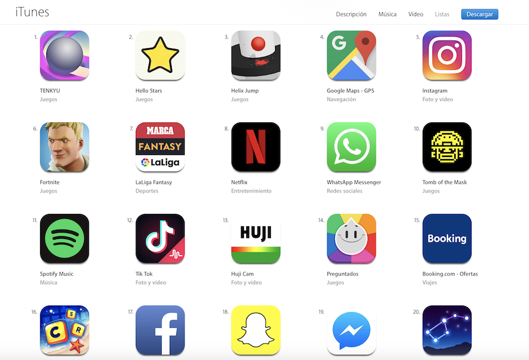

<!-- .slide: class="titulo" --> 
 
# Persistencia como servicio. Firebase
## Persistencia en dispositivos móviles


---

## Persistencia como servicio

En lugar de guardar los datos localmente, los guardamos **en la nube**

Algunas ventajas:

- Los datos son accesibles desde donde esté el usuario (aplicación web, móvil,...)
- Podemos compartir datos con otras plataformas, como Android

---

## Puntos a tratar

- **Backend as a Service**
- Autentificación y gestión de usuarios en Firebase
- Realtime Database en Firebase

---

<!-- .element: class="stretch"--> 


---

## Backend As A Service (BAAS)

Plataformas que ofrecen ya implementadas todas las funcionalidades que necesita una *app* con parte en el servidor:

- Autentificación
- CRUD de usuarios
- Persistencia
- Lógica de negocio en el servidor
- Analíticas de tráfico
- ...

---

<!-- .slide: data-background-image="img/hamaca.jpg" -->

---

## No todo son ventajas...

Pasamos a depender de un servicio externo que podría cambiar sus condiciones de uso o incluso desaparecer

<div class="stretch">
 
<div class="caption">[https://techcrunch.com/2016/01/28/facebook-shutters-its-parse-developer-platform](https://techcrunch.com/2016/01/28/facebook-shutters-its-parse-developer-platform)
</div>    
</div>

---

Apple ofrece **iCloud** como servicio de persistencia remoto, **solo iOS**. Aquí veremos como ejemplo **Firebase** de Google, que es **multiplataforma** (Android, iOS, web)


<!-- .element: class="column half" --> 

<!-- .element: class="column half" --> 


---

## Integrar Firebase en nuestras *apps*

- Darse de alta en [https://firebase.google.com](https://firebase.google.com)
- En la *consola web* de Firebase mantenemos los proyectos asociados a nuestras *apps* (en el archivo `GoogleService-Info.plist` del proyecto Xcode se mantiene info sobre el proyecto de servidor con el que conectar)
- Las librerías de Firebase se pueden [añadir al proyecto Xcode](https://firebase.google.com/docs/ios/setup) manualmente o bien con CocoaPods (recomendado)
- Inicializar Firebase en Swift

```swift
import Firebase

FirebaseApp.configure()
```

---

## Puntos a tratar

- Backend as a Service
- **Autentificación y gestión de usuarios en Firebase**
- Realtime Database en Firebase


---

## Autentificación de usuarios

Firebase ofrece muchas opciones para autentificación

- Con *email* y *password* (la que veremos aquí)
- Con un proveedor externo, actualmente Google/Facebook/Twitter/Github
- Código de un solo uso enviado por SMS
- Servidor de autentificación propio
- ...

---

Nota: la mayoría de los métodos del API de Firebase son **asíncronos** (ya que implican la comunicación con el servidor). Como último argumento hay que **pasarles una clausura** que se ejecutará al recibir la respuesta del servidor.

---

## Login/logout con *email* y *password*

**Login:** asíncrono, devuelve un [`AuthDataResult`](https://firebase.google.com/docs/reference/swift/firebaseauth/api/reference/Classes/AuthDataResult) entre cuyas propiedades está `user`, con info sobre el usuario autentificado (instancia de [`User`](https://firebase.google.com/docs/reference/swift/firebaseauth/api/reference/Classes/User))

```swift
Auth.auth().signIn(withEmail: email, password: password) { 
  (result, error) in
  if let error = error {
    print("Error")
  } else {
    print("Login de: \(result?.user.email!)")
  }
}
```

**Logout** es síncrono, ya que solo borra un *token* en el cliente

```swift
do {
  try Auth.auth().signOut()
} catch let signOutError as NSError {
  print("Error cerrando la sesión: \(signOutError)")
}
```

---

Para saber quién es el usuario autentificado actualmente

```swift
//Si no hubiera usuario autentificado, obtendríamos nil
let usuario = Auth.auth().currentUser
```

No obstante, al ser la autentificación asíncrona la manera recomendada es usar un *listener* de cambios en el estado de autentificación

```swift
//Inicializar listener
handle = Auth.auth().addStateDidChangeListener { (auth, user) in
  // ...
}

//Eliminar listener
Auth.auth().removeStateDidChangeListener(self.handle)
```

---

## Alta de usuarios

```swift
Auth.auth().createUser(withEmail: email, password: password) { 
    (result, error) in
    if let error = error {
        print("Error")
    }
    else {
        print("Dado de alta usuario con email: \(result?.user.email!)")
    }
}
```

- Al crear el usuario solo se proporciona *email* y *password*, el resto de datos (nombre, URL de foto de perfil) se dan al *actualizar* el perfil
- El desarrollador es responsable de gestionar el formulario de *login*, aunque con [FirebaseUI](https://firebase.google.com/docs/auth/ios/firebaseui) podemos usar una pantalla de autentificación ya hecha


---


- **Modificar** usuario

```swift
let changeRequest = Auth.auth().currentUser?.createProfileChangeRequest()
changeRequest?.displayName = displayName
changeRequest?.commitChanges { (error) in
  if let error = error {
     print("Error: \(error)")
  } 
  else {
     print("Perfil actualizado OK")
  }
}
```

- **Dar de baja** a un usuario

```swift
let user = Auth.auth().currentUser
user?.delete { error in
  if let error = error {
    print("Error")
  } else {
    print("Cuenta dada de baja")
  }
}
```

---

## Puntos a tratar

- Backend as a Service
- Autentificación y gestión de usuarios en Firebase**
- **Realtime Database en Firebase**

---

## Persistencia en Firebase

Actualmente hay 2 APIs distintos de persistencia en Firebase, ambas son almacenamientos de datos NoSQL

- ***Realtime Database***: 
    + Usa una estructura de datos peculiar, los datos se almacenan en un único árbol de datos JSON. 
    + Especialmente apropiada para aplicaciones con requerimientos en "tiempo real" ya que evita el *polling* (podemos "escuchar" los cambios en los datos)
- ***Cloud Firestore***: 
    + Aun siendo NoSQL, la estructura de los datos es más parecida a una BD relacional que la anterior. Hay *colecciones* y *documentos* (similares a tablas y registros, aunque sin relaciones)
    + También tiene algunas funcionalidades en "tiempo real"

---

## Realtime database: estructura de datos

La BD es un "árbol" de datos al estilo JSON, un objeto formado por pares propiedad/valor, donde los valores pueden ser a su vez objetos

A diferencia de JSON, no hay colecciones con `[...]`

```json
{
    "personas" : {
        "jap2" : {
            "nombre" : "Juan",
            "apellidos": "Arriquitaun Pérez"
        },
        "ems21" : {
            "nombre" : "Eva",
            "apellidos": "Marín Salgado"
        }
    }
}
```

---

Al no existir relaciones como tal, la forma más habitual de expresarlas es **embebiendo** los datos. Por ejemplo para indicar los mensajes que ha enviado un usuario en un chat podríamos hacer

```json
{
  "personas" : {
    "ems21" : {
      "apellidos" : "Marín Salgado",
      "nombre" : "Eva",
      "mensajes" : {
        "m1" : {
          "texto" : "Hola amigos",
          "timestamp" : 19029898493
        },
        "m2" : {
          "texto" : "¿No me contesta nadie? :(",
          "timestamp" : 20458569556
        }
      }
    },
    "jap2" : {
      "apellidos" : "Arriquitaun Pérez",
      "direccion" : {
        "calle" : "Pez, 25",
        "localidad" : "Madrid"
      },
      "mensajes" : {
        "m3" : {
            "texto": "Hola, sí!!"
            "timestamp" : 21020129382
        }
      },
      "nombre" : "Juan"
    }
  }
}
```

---

Problema de la estructura anterior: es difícil obtener los mensajes enviados al chat independientemente del usuario.

Solución: **desnormalizar** los datos duplicando la información

```json
{
  "personas" : {
    //Igual que antes, personas con sus mensajes
  }
  "mensajes" : {
    //Aquí todos los mensajes de todos los usuarios
    "m1" : {
          "texto" : "Hola amigos",
          "timestamp" : 19029898493,
          "usuario": "ems21"
        },
    "m2" : {
          "texto" : "¿No me contesta nadie? :(",
          "timestamp" : 20458569556,
          "usuario": "ems21"
        },
    "m3" : {
            "texto": "Hola, sí!!",
            "timestamp" : 21020129382,
            "usuario": "jap2"
        }    
  }
}
```

---

## Referencias

Representan nodos concretos. Son como los *paths* en un sistema de archivos. Con una referencia a un nodo podemos

- Leer/modificar su estado
- Obtener la referencia de los nodos hijos del actual (y así sucesivamente)


---

## Obtener una referencia


```json
{
    "personas" : {
        "jap2" : {
            "nombre" : "Juan",
            "apellidos": "Arriquitaun Pérez"
        },
        "ems21" : {
            "nombre" : "Eva",
            "apellidos": "Marín Salgado"
        }
    }
}
```

- La BD en sí se obtiene con `Database.database()`
- El nodo raíz se obtiene con `reference()`, y podemos ir a los hijos con `child()`

```swift
//El árbol completo, dicho de otro modo el nodo raíz
let rootRef = Database.database().reference()
//El nodo "personas"
let personasRef = rootRef.child("personas")
//El nodo "nombre" perteneciente a "jap2"
let nombreRef = personasRef.child("jap2").child("nombre")
```

---

## Obtener una referencia (2)

- Acceder a un nodo con su *path* desde el nodo raíz con `reference(withPath:)`:

```swift
let db = Database.database()
//El nodo "nombre" perteneciente a "jap2"
let nombreRef = db.reference(withPath:"personas/jap2/nombre")
```

- Podemos obtener una referencia a un nodo que no exista (útil para crear nodos nuevos)

```swift
let db = Database.database()
let direccionRef = db.reference(withPath:"personas/jap2/direccion")
```


---

## Modificar un nodo

- `setValue(<nuevovalor>)` sobre su referencia. 
- CUIDADO: sustituye completamente el valor actual del nodo, incluso aunque este tenga otros nodos hijos

```swift
let db = Database.database()
let nombreRef = db.reference(withPath:"personas/jap2/nombre")
//El nombre cambia de Juan a John
nombreRef.setValue("John")
//CUIDADO, sustituye el valor de "personas", con todo lo que hay por debajo
let personasRef = db.reference(withPath:"personas")
personasRef.setValue("¡¡La que acabas de liar!!")
```

---

También podemos **crear un nodo aunque los nodos intermedios no existan**

```swift
self.db = Database.database()
//Este nodo no existe, pero vamos a usar la referencia para crear un valor
let mlmj15 = db.reference(withPath: "personas/mlmj15")
mlmj15.setValue(["nombre":"María Luisa", "apellidos":"Marín Juárez"])
```

---

Para **asignar un valor compuesto, basta con pasar un diccionario**. Por ejemplo, Podríamos cambiar los datos de "mlmj15" con:

```swift
let db = Database.database()
let ref = db.reference(withPath:"personas/mlmj15")
ref.setValue(["nombre":"Mari Loli", "apellidos":"Martínez Jaén"])
```

---

**En lugar de sobreescribir totalmente un nodo podemos actualizar solo algunas de sus propiedades** con `updateChildValues`

```swift
let db = Database.database()
let ref = db.reference(withPath:"personas/mlmj15")
ref.updateChildValues(["nombre":"M.L."])
```

---

**Generar un identificador automáticamente** con `childByAutoId`.

```swift
let db = Database.database()
let personasRef = db.reference(withPath:"personas")
let nuevoIdRef = personasRef.childByAutoId()
nuevoIdRef.setValue(["nombre":"Luis Ricardo", "apellidos":"Borriquero"])
```

```json
{
  "personas" : {
    "L33iv1bhzKkFkQd_ff4" : {
      "apellidos" : "Borriquero",
      "nombre" : "Luis Ricardo"
    },
    ...
  }
}
```

- El algoritmo de generación de *id*s asegura que no hay colisiones entre los identificadores generados por los distintos clientes. 
- El *id* incluye un *timestamp*, al ordenar por *id* ordenamos implícitamente por orden de inserción.

---

## Borrar datos

- `removeValue()`. 
- O también `setValue(nil)`
- O para borrar una propiedad ponerla a `nil` con `updateChildValues`

---

## Consultas en "tiempo real"

Observar cambios en un nodo, incluyendo los que hay "por debajo"

```swift
let db = Database.database()
let personasRef = db.reference(withPath:"personas")
personasRef.observe(.value) {
    snapshot in
    print("Algo ha cambiado en \(snapshot.value)")
}
```

Cuidado: "escuchar" en un nivel muy alto (cerca de la raíz) es muy ineficiente


---

## Dejar de escuchar los cambios

- `removeObserver`

```swift
...
//añadimos el "listener" y nos guardamos el handle
let handle = personasRef.observe(.value) {
    ...
}
//eliminamos el "listener" anterior usando el handle
personasRef.removeObserver(withHandle: handle)
//también podríamos hacer esto para eliminar todos los listener sobre personasRef
personasRef.removeAllObservers()
```

---

## Escuchar eventos concretos: inserción, borrado, ...


```swift
let db = Database.database()
let personasRef = db.reference(withPath:"personas")
personasRef.observe(.childAdded) {
   snapshot in
   print("\(snapshot.key)=\(snapshot.value)")
}
```

---

## Consultas "clásicas"

- `observeSingleEvent`: solo nos interesa el estado actual del nodo, no los cambios sucesivos

```swift
let db = Database.database()
let personasRef = db.reference(withPath:"personas")
personasRef.observeSingleEvent(.childAdded) {
   snapshot in
   print("\(snapshot.key)=\(snapshot.value)")
}
```

---


# ¿Alguna pregunta?