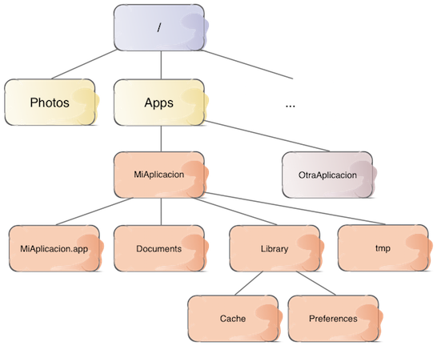
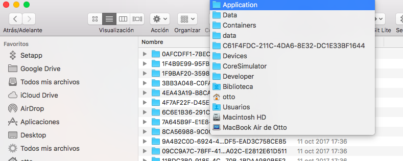
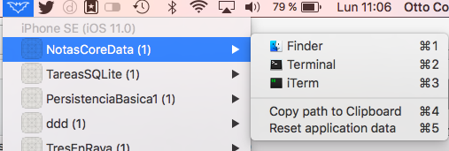
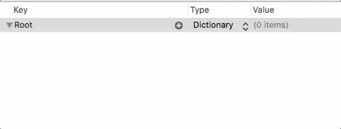

<!-- .slide: class="titulo" -->
# Sesión 1. Persistencia básica
## Persistencia en Dispositivos Móviles (iOS)

---

## Persistencia de datos en iOS

- **Persistencia "básica"** (poca cantidad de datos, no ofrece mecanismos de búsqueda y organización sofisticados)
  + Property Lists
  + Preferencias de usuario
  + Serialización de objetos

---

## Persistencia de datos en iOS (2)

- **"Bases de datos"** (mayor cantidad de datos, mecanismos de búsqueda)
  + SQLite
  + Core Data
  + APIs propios (iCloud), APIs de terceros (en "la nube", p.ej. Firebase) 

---

## Persistencia de datos en iOS (y 3)

- **"Objetos persistentes"** del sistema, accesibles desde las aplicaciones
  + Documentos
  + Calendario
  + Contactos
  

---

## Puntos a tratar hoy

- El sistema de archivos en iOS
- Serialización
- *Property Lists*
- Preferencias del usuario


---

## Puntos a tratar hoy

- **El sistema de archivos en iOS**
- Serialización
- *Property Lists*
- Preferencias del usuario

---

<!-- .slide: class="dim" -->
<!-- .slide: data-background-image="http://dreams.metroeve.com/wp-content/uploads/2017/02/dreams.metroeve_sandbox-dreams-meaning.jpeg" -->

## *Sandboxing*

Cada aplicación está contenida en un **sandbox** de modo que únicamente ella puede acceder a sus propios datos. Esto incluye los archivos y directorios de la aplicación


---

## Los directorios del *sandbox*



---

## Paths vs URLS

En el API podemos usar *paths* o *URLs* para localizar un archivo o directorio

- Normalmente en los métodos que usan *path* su nombre acaba en `Path` y el método equivalente con URLs se llama igual pero acabado en `URL` 
- La documentación recomienda URLs por uniformidad 


```swift
//¿Dónde está el "bundle" de la aplicación?
let bundleDir : String = Bundle.main.bundlePath
let bundleURL : URL = Bundle.main.bundleURL
```

---

## El `FileManager`

- Es el encargado del acceso al *sandbox*. No hace falta crearlo, `FileManager.default` es el *manager* por defecto
- Tiene métodos para
  + Obtener la ruta física de los directorios del *sandbox*
  + Realizar operaciones con directorios (listar, ...) y archivos (copiar, eliminar, ...)

```swift
...
try FileManager.default.copyItem(at: urlOriginal, to: urlCopia)) 
...
```

---

## Acceso a los directorios del *sandbox*

- Método `urls(for:in:)`, del `FileManager`
    + `for`: cte. que especifica directorio (`.documentDirectory`, `.cachesDirectory`, ...)

```swift
let urls = FileManager.default.urls(for:.documentDirectory, in:.userDomainMask)
//Nótese que el método devuelve un array de URLs
//Casi siempre nos interesa solo la primera
if(urls.count>0) {
    let docDir = urls[0]
    print("El directorio 'Documents' es \(docDir)")
}
else {
    print("error al buscar el directorio 'Documents'")
}
```

---

## ¿Dónde está físicamente el *sandbox*?

- El simulador mapea el *sandbox* con un directorio físico del Mac
- Útil verlo para comprobar si nuestra *app* crea bien los datos
- Por desgracia, la URL local del *sandbox* depende de un id de aplicación que Xcode genera dinámicamente y es difícil identificar



---

Hay *apps* para poder acceder fácilmente al directorio del Mac corespondiente al *sandbox* del simulador. Por ejemplo:

[https://github.com/dsmelov/simsim](https://github.com/dsmelov/simsim)



**LA NECESITAREIS PARA LOS EJERCICIOS**

---

## Puntos a tratar hoy

- El sistema de archivos en iOS
- **Serialización**
- *Property Lists*
- Preferencias del usuario

---

## Serialización desde Swift 4

- *Encoding*: transformar una estructura de datos en memoria a una secuencia de bytes en un formato determinado (JSON, XML, ...)
- *Decoding* es el proceso contrario

---

- Para que una clase/struct sea serializable debe ser conforme al protocolo `Encodable`. El protocolo contrario es `Decodable`. `Codable` es la unión de ambos

```swift
//único método declarado por `Encodable`
func encode(to: Encoder) throws
//único método declarado por Decodable
init(from decoder: Decoder) throws
```

lo genera automáticamente el compilador si  nuestra clase está compuesta por tipos `Encodable`/`Decodable`s. (`String`, `Int`, `Float`, `Date`, `Array`...)

Conclusión: si nuestros campos son `Codable`, nuestra clase/struct lo será automáticamente

---

Por ejemplo:

```swift
struct Alumno  {
    var nombre : String
    var nota: Float
    var fechaNacimiento: Date
}
```

Para que sea *serializable/deserializable* simplemente declaramos que es conforme al protocolo `Codable` :

```swift
struct Alumno : Codable {
    var nombre : String
    var nota: Float
    var fechaNacimiento: Date
}
```


---

## Serializar/deserializar los datos

- Según el formato de serialización tenemos diferentes *encoders* y *decoders*: `PropertyListEncoder`, `JSONEncoder`,...
- También podemos escribir nuestros propios *encoder/decoder*

```swift
struct Alumno : Codable  {
    var nombre : String
    var nota: Float
    var fechaNacimiento: Date
}

let jsonData = """
{
  "nombre": "Pepe",
  "nota" : 10,
  "date": "2001-04-14T16:00:49Z"
}
""".data(using: .utf8)!

let decoder = JSONDecoder()
decoder.dateDecodingStrategy = .iso8601
let alumno = try decoder.decode(Alumno.self, from:jsonData)
```

---

## Property Lists

Estructuras de datos tipo **pares de clave-valor** muy usadas en iOS para almacenar datos de configuración. 

Tienen dos limitaciones:

- No se puede almacenar cualquier tipo, solo algunos: `String`, valores numéricos, `Data`, `Date` o `Boolean`. Y como colecciones  `Array` y `Dictionary`.
- No son modificables, es decir, no se puede cambiar un único dato en el archivo



---

## Formato físico de las *property lists*

Se pueden almacenar en archivos en modo texto o binario. En  modo texto se usa el formato XML:

```xml
<?xml version="1.0" encoding="UTF-8"?>
<!DOCTYPE plist PUBLIC "-//Apple//DTD PLIST 1.0//EN" "http://www.apple.com/DTDs/PropertyList-1.0.dtd">
<plist version="1.0">
<dict>
    <key>colorFondo</key>
    <array>
        <integer>255</integer>
        <integer>255</integer>
        <integer>0</integer>
    </array>
    <key>fuente</key>
    <string>System</string>
</dict>
</plist>
```

La *raíz* de la estructura de datos puede ser un diccionario, como en el ejemplo, o un array.

---

## Leer una *property list*

- Usando el *decoding* de Swift 4, clase `PropertyListDecoder`

```swift
struct Props : Codable {
    var nombre : String
    var puntuacion : Int
}
```

```swift
let urlDocs = FileManager.default.urls(for:.documentDirectory,
                                       in:.userDomainMask)[0]
let plistURL = urlDocs.appendingPathComponent("result.plist")
let data = try Data(contentsOf: plistURL)
let decoder = PropertyListDecoder()
let misProps = try decoder.decode(Props.self, from: data)
print(misProps)
```

---

## Guardar una *property list*

- Con `PropertyListEncoder`:

```swift
let urlDocs = FileManager.default.urls(for:.documentDirectory,
                                       in:.userDomainMask)[0]
let urlPlist = urlDocs.appendingPathComponent("result.plist")
let encoder = PropertyListEncoder()
encoder.outputFormat = .xml
let misProps = Props(nombre:"John", puntuacion:100)
let data = try encoder.encode(misProps)
try data.write(to: urlPlist)
```

---


## Preferencias

- iOS ofrece un API estándar para almacenar/recuperar preferencias de una *app*
- El API permite establecer valores por defecto, modificarlos y leer los valores ya fijados. El API trata solo con los datos, la interfaz de usuario es cosa nuestra


---

### Qué se puede guardar en las preferencias

- Las preferencias no son más que una *property list* en la que el objeto “raíz” es un `Dictionary`. El sistema se encarga de serializar/deserializar los valores a/desde un archivo `.plist` de modo automático.

- El fichero `.plist` con las preferencias se almacena automáticamente en el directorio `Library/Preferences` de la aplicación. Su nombre será el del proyecto de Xcode, precedido del "organization identifier" del proyecto. 

- Por defecto el `.plist` se genera en formato binario

---

## Acceder a las preferencias

Las preferencias del usuario actual son accesibles a través del *singleton* de la clase `UserDefaults`

```swift
let preferencias = UserDefaults()
```

Cada preferencia tiene una clave, que será una cadena, y un valor. Así, podemos acceder a una preferencia con una familia de métodos `xxx(forKey:)`, donde la "xxx" varía según el tipo de datos: `integer`, `bool`, `float`, `double`, `array`, `object`,…

```swift
let nick = preferencias.string(forKey:"nick");
let nivel = preferencias.integer(forKey: "nivel")
```

---

## Valores por defecto

- Cuando se lee un valor no fijado se obtiene "vacío" (`nil` en `Strings`, 0 en números)
- Problema: ¿cómo saber si un valor numérico es 0 o no está fijado?
- Registrar valores por defecto pasándole un diccionario al método `register(defaults:)` de `UserDefaults`:

```swift
let prefs = UserDefaults()
prefs.register(defaults:[
  "nick" : "anonimo",
  "nivel" : 1
])
```

- *Los valores por defecto no son permanentes*. Es decir, que hay que registrarlos cada vez que arranque la aplicación.

- Si registramos un valor por defecto y este ya ha sido fijado por código el valor por defecto no “machacará” al ya fijado.

---

## Modificar las preferencias

- Familia de métodos `set(valor,forKey:)`

```swift
let prefs = UserDefaults()
prefs.set(5, forKey:"nivel")
prefs.set("Pepito", forKey:"nick")
```

- Por eficiencia iOS no hace persistente el cambio inmediatamente sino a intervalos regulares o justo antes de salir de la aplicación. 
- Podemos forzar el cambio en el `.plist` llamando al método `synchronize` de las preferencias

```swift
UserDefaults().synchronize()
```

---

## Preferencias en el panel de control general

- Podemos colocar algunas preferencias en el `Preferencias` de iOS. Apple recomienda colocar aquí solo las preferencias que varíen muy ocasionalmente (por ejemplo permisos de acceso, credenciales de servicios *online*,...)
- *Settings bundle*: no es un API sino un `.plist` especial donde se configuran las preferencias (File > New > Settings bundle)


