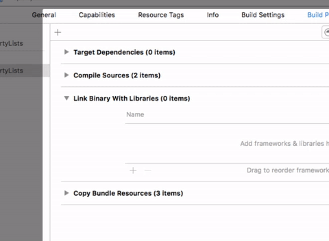

<!-- .slide: class="titulo" -->
# Sesión 2. SQLite
## Persistencia en Dispositivos Móviles (iOS)

---

## Puntos a tratar

- **SQLite en iOS**
- Acceso básico a la BD
- Consultas de selección
- Consultas de actualización
- *Frameworks* de terceros

---

## SQLite en iOS

- SQLite es una BD embebida (no necesita servidor), ligera y portable, disponible en multitud de plataformas (Mac, Linux, Windows, Android, iOS ...)
- Problema en iOS: **no hay un API Swift oficial**, ya que Apple recomienda usar "Core Data" en lugar de SQLite directamente.  
- Lo más habitual es usar el [**API C de SQLite**](http://www.sqlite.org/cintro.html). No hay problema al ser Swift interoperable con Objective C y C

---

## Configurar el proyecto para SQLite

Añadir **manualmente** la librería


<!-- .element: class="stretch" -->

Para usar C en un proyecto Swift hay que crear un *bridging header*

```c
#include <sqlite3.h>
```


---

## Puntos a tratar

- SQLite en iOS
- **Acceso básico a la BD**
- Consultas de selección
- Consultas de actualización
- *Frameworks* de terceros

---

## Crear la Base de Datos y añadirla al proyecto

- Normalmente se copia al *bundle* de la aplicación
- Como el *bundle* es de solo lectura, lo primero al abrir la *app* es hacer una copia, por ejemplo en *Documents*

```swift
 if let dbURL = Bundle.main.url(forResource: nombreBD, withExtension: "db") {
    if (try? fileManager.copyItem(at: dbOriginalURL, to: dbCopiaURL)) != nil {
        return dbCopiaURL
    }
    else {
        return nil
    }
}
```

---

## Acceso básico a la base de datos

- En SQLite con C, la BD se representa con un puntero a un `struct` de tipo `sqlite3`. Para representar un puntero C en Swift usamos `OpaquePointer`:

```swift
var db: OpaquePointer? = nil
```

- Abrir la BD: función `sqlite3_open `, a la que hay que pasarle el *path* de la base de datos y el puntero a este *struct*

```swift
sqlite3_open(path_db, &db);
```

---

## Puntos a tratar

- SQLite en iOS
- Acceso básico a la BD
- **Consultas de selección**
- Consultas de actualización
- *Frameworks* de terceros

---

## Pasos para ejecutar una consulta de selección


1. Compilar la *query* (SQL en “modo texto” -> formato “ejecutable”)
2. Mientras queden registros avanzar uno por los resultados
  - Obtener los campos que nos interesen del registro actual, sabiendo el número de columna que ocupan
  - Normalmente “empaquetaremos” los valores del registro actual en un objeto/struct, e iremos construyendo un array de resultados.
3. Liberar la memoria ocupada por la *query* compilada

---

## Consulta de selección: ejemplo de código

```swift
let querySQL = "SELECT * FROM Personas"
var statement : OpaquePointer?;
var lista : [Persona] = [];

let result = sqlite3_prepare_v2(db, querySQL, -1, &statement, nil)
if (result==SQLITE_OK) {
    while (sqlite3_step(statement) == SQLITE_ROW) {
        let id = sqlite3_column_int(statement, 0)
        let nombre = String(cString: sqlite3_column_text(statement, 1))
        let persona = Persona(id: Int(id), nombre: nombre)
        lista.append(persona)
    }
}
sqlite3_finalize(statement);
for p in lista {
    print("\(p.id) \(p.nombre)")
}
```

---

## Fechas en SQLite

- SQLite no tiene tipo fecha. Podemos representarla con una cadenas o un entero (“UNIX timestamp”). Ejemplo de esto último:

```swift
//COMO EXTRAER LA FECHA Y OBTENER UN DATE
//supongamos que la columna 2 es una fecha en formato timestamp UNIX
let unix_time = sqlite3_column_int(statement, 2);
//Convertimos a tipo fecha de Swift
//TimeInterval es equivalente a Double, lo necesita este constructor de Date
let fecha = Date(timeIntervalSince1970: TimeInterval(unix_time))

//ESTO ES SOLO PARA IMPRIMIR LA FECHA
//La clase DateFormatter nos permite mostrar una fecha
let df = DateFormatter()
//Hay una serie de estilos predefinidos
df.dateStyle = .full
print("\(df.string(from: fecha))")
```

---

## Consultas con parámetros


```swift
let querySQL = "SELECT * FROM alumnos WHERE fecha_nacimiento < ?"
```

- Vincular parámetros por posición: `sqlite3_bind_XXX` donde XXX es el tipo de datos.

```swift
let querySQL = "SELECT * FROM alumnos WHERE fecha_nacimiento<?"
var statement : OpaquePointer?

let result = sqlite3_prepare_v2(db, querySQL, -1, &statement, nil)
let cal = Calendar.current
let hace18 = cal.date(byAdding: Calendar.Component.year, value: -18, to: Date(), wrappingComponents: false)
sqlite3_bind_int(statement, 1, Int32(hace18!.timeIntervalSince1970))
```

---

## Parámetros con nombre


```swift
let querySQL = "SELECT * FROM alumnos WHERE fecha_nacimiento < :fecha";
```

- No obstante el API C no nos permite instanciar el parámetro directamente por nombre. Primero debemos obtener su posición con la función `sqlite3_bind_parameter_index(sentencia,nombre)` y luego aplicar la ya conocida `sqlite3_bind_XXX()`. 


---

## Puntos a tratar

- SQLite en iOS
- Acceso básico a la BD
- Consultas de selección
- **Consultas de actualización**
- *Frameworks* de terceros

---

## Consultas de actualización

```swift
let querySQL = "INSERT INTO alumnos (nombre, fecha_nacimiento) VALUES (?,?)"
var statement : OpaquePointer?
sqlite3_prepare_v2(db, querySQL, -1, &statement, nil);
sqlite3_bind_text(statement, 1, nombre, -1, nil);
sqlite3_bind_int(statement, 2, Int32(fechaNacimiento.timeIntervalSince1970));
let result = sqlite3_step(statement);
if (result==SQLITE_DONE) {
    print("Registro almacenado OK");
}
```

Podemos contar cuántas filas han sido afectadas 

```swift
var db : OpaquePointer?
...
print("Filas afectadas: \(sqlite3_changes(db))";
```

---

## Puntos a tratar

- SQLite en iOS
- Acceso básico a la BD
- Consultas de selección
- Consultas de actualización
- ***Frameworks* de terceros**

---

## Frameworks de terceros para SQLite

- Han surgido unos cuantos APIs de terceros para "llenar el vacío" de un API SQLite en Swift que Apple no está dispuesto a desarrollar.
- De ellos el más conocido es [FMDB](https://github.com/ccgus/fmdb)

---

## Abrir BD + ejecutar consulta de selección

```objectivec
let dbPath = Bundle.main.path(forResource: "prueba", ofType: "db")
if let db = FMDatabase(path: dbPath) {
    if (!db.open()) {
        print("Error al abrir la bd: \(db.lastErrorMessage())")
    }
    else {
        if let resultSet = try? db.executeQuery("SELECT * FROM Personas", values: nil) {
            while (resultSet.next()) {
               print(resultSet.string(forColumn: "nombre"))
            }
        }
    }
}
```

- con consultas de actualización se usa `executeUpdate`

---

## Las consultas son mucho más sencillas

- Con parámetros por posición

```swift
let rs = db.executeQuery("SELECT * FROM alumnos
                       where fecha_nacimiento<?", values:[fecha_ref];
```

- Con parámetros por nombre

```swift
let query = "INSERT INTO personas (dni, nombre) VALUES (:dni, :nombre)"
let datos = [
    "dni" : "1222333K",
    "nombre": "Pepito"
]
db.executeUpdate(query, withParameterDictionary: datos)
```

---

# ¿Alguna pregunta?