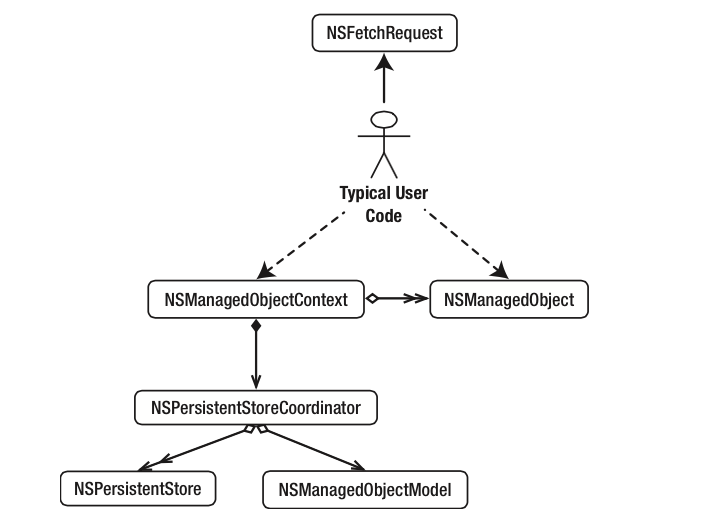
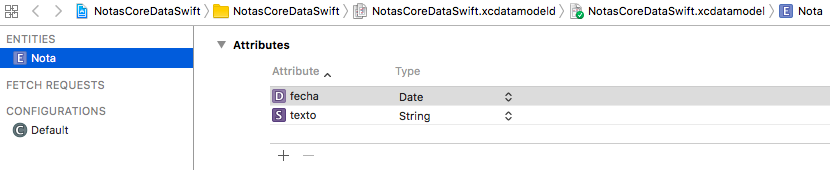

<!-- .slide: class="titulo" -->
# Sesión 3: ¡Hola Core Data!
## Persistencia en dispositivos móviles, iOS


---

## Puntos a tratar

- **Qué es Core Data**
- El *stack* de Core Data
- Entidades
- Crear, guardar y recuperar objetos

---

## ¿Qué es Core Data?

El *framework* de persistencia de iOS. Almacena de forma **persistente los objetos de nuestra aplicación**. Es capaz de guardar un **grafo entero de objetos con sus relaciones** (uno a uno, uno a muchos, muchos a muchos) 

---

## Core Data es un ORM

- *Object Relational Mapper*, permite almacenar de forma persistente objetos en una base de datos relacional (SQLite)
- Los que hayáis usado JPA(Java), Entity Framework(.NET), Doctrine (PHP), Active Record (Ruby), ... veréis ideas muy similares (y terminología, en algunos casos)

---

## ... bueno, no, en realidad no lo es


Estrictamente hablando, **no es un ORM** ya que no soporta más que SQLite y además soporta otros almacenes de datos no relacionales (datos en memoria, archivos XML - *solo en OSX*, almacenes propios,...)

---


> Core Data is [...] capable of dealing with large volumes of data. The SQLite store can scale to terabyte sized databases with billions of rows/tables/columns. [...] 10,000 objects is considered to be a fairly small size for a data set.

> For a very simple application it is certainly the case that Core Data adds some overhead [...], however, [...] supports undo and redo, validation, object graph maintenance, and provides the ability to save objects to a persistent store. If you implemented this functionality yourself, it is quite likely that the overhead would exceed that imposed by Core Data.

[Core Data Performance, Apple Developer Docs](https://developer.apple.com/library/archive/documentation/Cocoa/Conceptual/CoreData/Performance.html)

---

## Puntos a tratar

- Qué es Core Data
- **El *stack* de Core Data**
- Entidades
- Crear, guardar y recuperar objetos


---



Tomado del libro "Pro Core Data for iOS" (2nd ed.), Apress 2011, pág 30
<!-- .element: style="font-size:0.5em" -->

---

## El *stack* de Core Data (1)

- `NSPersistentStore`: se ocupa de gestionar el almacenamiento persistente. Podemos crear nuestros propios almacenes de datos creando subclases de ella.
- `NSPersistentStoreCoordinator`: el núcleo de Core Data. Responsable de gestionar la persistencia (interactúa con el `NSPersistentStore`). 
  + Nuestro código no va a interactuar apenas con esta clase, salvo en su inicialización.

---

## El *stack* de Core Data (2)

- `NSManagedObjectModel`. similar a un modelo E-R en una BD relacional, define las “clases” del dominio, sus atributos y las relaciones entre clases. 
- En Xcode un modelo de datos se representa con un archivo `.xcdatamodeld` (hay un editor visual). El `NSManagedObjectModel` es la versión compilada y binaria de este archivo.


---

## El *stack* de Core Data (3)

- `NSManagedObjectContext`  es el “contexto de persistencia” (un grafo de objetos, relacionados entre sí, y cuyo ciclo de vida está gestionado - *managed* - por Core Data)
- `NSManagedObject`: los objetos gestionados
  - Podemos usar esta clase o crear descendientes. Así podemos usar nuestras propias clases como objetos persistentes.


---

## El *stack* de Core Data (y 4)

- `NSFetchRequest`. Al igual que en SQL podemos ejecutar consultas especificando las condiciones para los objetos a recuperar.


---

## Inicializar el *stack*

Para trabajar con Core Data necesitamos inicializar todas estas clases. Si al crear un nuevo proyecto marcamos la casilla `Use Core Data`, Xcode insertará código que lo hará por nosotros

A partir de iOS10 este código es muy sencillo, se include en el *delegate*:

```swift
lazy var persistentContainer: NSPersistentContainer = {
   let container = NSPersistentContainer(name: "PruebaCoreData")
    container.loadPersistentStores(completionHandler: { (storeDescription, error) in
        if let error = error as NSError? {
             fatalError("Unresolved error \(error), \(error.userInfo)")
        }
    })
    return container
}()
```

---

## Usar el *stack*

Normalmente nos basta con acceder al contexto

```swift
if let miDelegate = UIApplication.shared.delegate as? AppDelegate {
    let miContexto = miDelegate.persistentContainer.viewContext
    ...
} 
```

---

## Puntos a tratar

- Qué es Core Data
- El *stack* de Core Data
- **Entidades**
- Crear, guardar y recuperar objetos

---

Las entidades son los tipos de objetos que queremos hacer persistentes. Se corresponderían con las tablas de la base de datos

Se pueden crear por código pero típicamente se crean en un editor "gráfico"



---

## Puntos a tratar

- Qué es Core Data
- El *stack* de Core Data
- Entidades
- **Crear, guardar y recuperar objetos**

---

## Crear un objeto gestionado

No podemos hacerlo con un inicializador, Core Data debe gestionar el ciclo de vida del objeto: desde que nace hasta que desaparece

```swift
import CoreData

if let miDelegate = UIApplication.shared.delegate as? AppDelegate {
    let miContexto = miDelegate.persistentContainer.viewContext
    let nuevaNota = NSEntityDescription.insertNewObject(forEntityName: "Nota", 
                                                        into: miContexto)
}
```

`nuevaNota` es de la clase `NSManagedObject`, propia de Core Data

---

## Rellenar los campos del objeto gestionado

`NSManagedObject` es una clase "genérica", podemos acceder a las propiedades de nuestra entidad usando un mecanismo llamado KVC (Key-Value Coding)

Modificar las propiedades:

```swift
nuevaNota.setValue("probando notas", forKey: "texto")
nuevaNota.setValue(Date(), forKey: "fecha")
```

Obtener las propiedades

```swift
//ponemos el ! porque value(forKey:) devuelve un opcional
nuevaNota.value(forKey: "texto")!
```

---

## Guardar los objetos en el almacenamiento persistente

`save` sobre el contexto guarda todos los cambios en el grafo de objetos gestionados, de la memoria al almacenamiento persistente

```swift
//miContexto es el contexto de Core Data, hay que obtenerlo antes
do {
   try miContexto.save()
} catch {
   print("Error al guardar el contexto: \(error)")
}
```

---

## Recuperar objetos

Se hace con *fetch requests*, el equivalente a las consultas de SQL. Ya veremos la sintaxis. El siguiente ejemplo simplemente obtiene todas las entidades de un tipo (como un `SELECT * FROM` sin `WHERE`)

```swift
let request : NSFetchRequest<NSFetchRequestResult> = NSFetchRequest(entityName:"Nota")
//"miContexto" es el contexto de Core Data 
//FALTA el código que obtiene "miContexto", como se ha hecho en ejemplos anteriores
if let notas = try? miContexto.fetch(request) as! [NSManagedObject] {
   for nota in notas {
       print(nota.value(forKey: "texto")!)
   }
}
```

---

# ¿Alguna pregunta?