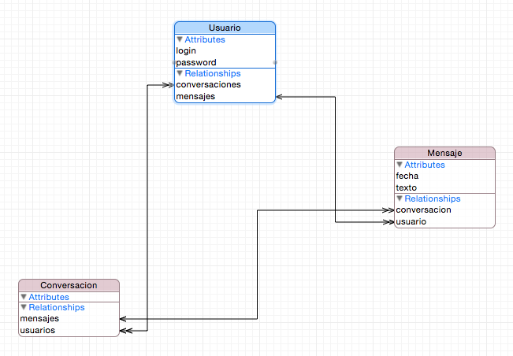

# Sesión 4: Modelos de datos en Core Data (I)
## Persistencia en dispositivos móviles, iOS


---

## Puntos a tratar

- **Creación y edición del modelo de datos**
- CRUD de objetos gestionados


---

## Entidades

- Comparten ciertas características con las clases de la POO y otras con las tablas de una base de datos. 
    - De POO: Pueden ser *abstractas* 
    - De BD: Tienen relaciones con otras entidades (uno-a-uno, uno-a-muchos,…). Tienen reglas de borrado "en cascada" (qué hacer cuando uno de los “lados” de la relación se elimina)


---



---

## Crear y editar el modelo de datos

Ya hemos visto que Xcode tiene un editor visual, vamos a verlo con más detalle

---

# DEMO: crear un modelo de datos 

---

## Todas las entidades son `NSManagedObject`

En la sesión anterior, las notas estaban representadas en el código por `NSManagedObject`, y accedíamos a las propiedades con KVC

```swift
for objeto in resultados {
    print(obj.value(forKey:"texto")!
} 
```

Si en el modelo hay varias entidades, tratarlas todas como `NSManagedObject` hace el código algo confuso, además de que KVC es un poco tedioso.

---

## Clases propias como entidades

- Es mejor definir nuestras propias clases Swift: `Usuario`, `Mensaje`, `Conversacion`,... y usarlas como entidades
- Xcode nos puede generar el esqueleto de la clase, junto con *getters* y *setters* para propiedades y relaciones.

---

# DEMO: generar subclases de `NSManagedObject`

1. Generación automática
2. Generación manual

---


## Puntos a tratar

- Creación y edición del modelo de datos
- **CRUD de objetos gestionados**


---

Las operaciones más comunes sobre los objetos gestionados son crear, listar, actualizar y borrar, lo que típicamente se conoce como **CRUD (Create/Read/Update/Delete)**

---

## Creación de entidades y asignación de atributos

Ya vimos en la sesión anterior cómo crear y guardar un objeto gestionado. Ahora podemos hacer lo mismo usando nuestras propias clases, sin KVC

```swift
if let miDelegate = UIApplication.shared.delegate as? AppDelegate {
   let miContexto = miDelegate.persistentContainer.viewContext
   //La sintaxis de creación es mucho más simple que insertNewObject
   let u = Usuario(context:miContexto)
   //Si somos masoquistas, también lo podríamos hacer como antes:
   //let u = NSEntityDescription.insertNewObject(forEntityName: "Usuario", into: miContexto) as! Usuario
   //Al tener una clase propia, podemos usar las propiedades directamente, sin KVC
   u.login = "Pepe"
   u.password = "123456"
   try! miContexto.save()
}
```

---

## ¡¡Cuidado!!

Recordad que **lo siguiente NO es correcto**, como ya se ha dicho Core Data tiene que gestionar el ciclo de vida completo del objeto

```swift
var usuario = Usuario()
usuario.login = "Pepe"
```

O creamos el objeto con `init(context:)` o con `insertNewObject` o lo obtenemos de los que ya existen con una *fetch request*

---

## Manejar las relaciones "a uno"

Xcode crea campos que representan en realidad las relaciones

relaciones *a uno*: para establecer la relación simplemente asignar el valor

```swift
let u = Usuario(context:miContexto)
u.login = "Pepe"
let m = Mensaje(context:miContexto)
m.texto = "Hola, soy Pepe"
m.usuario = u
```

---

## Establecer una relación y la inversa

Cuando establecemos una relación Core Data **actualiza automáticamente la inversa**

```swift
let m = Mensaje(context:miContexto) 
m.texto = "hola amigos"
m.fecha = Date()
//Supongamos "u" un objeto Usuario gestionado por Core Data
//Establecemos una relación Mensaje->Usuario
m.usuario = u;
//Core Data hace lo propio con Usuario->>Mensaje (1 a N)
print("Mensajes del usuario \(u.login)")
//Aquí debería aparecer el mensaje "hola amigos" (y más si los hubiera) 
for mensaje in u.mensajes {
        print("\(mensaje.fecha) \(mensaje.texto)")
}
```

---

## Manejar las relaciones "a muchos"

Xcode crea *accesores*, métodos para añadir/modificar/eliminar elementos de una relación *a muchos*

```swift
if let miDelegate = UIApplication.shared.delegate as? AppDelegate {
    let miContexto = miDelegate.persistentContainer.viewContext
    let u = Usuario(context:miContexto)
    u.login = "Pepe"
    u.password = "123456"
    let m = Mensaje(context:miContexto)
    m.texto = "hola, soy Pepe"
    m.fecha = Date()
    u.addToMensajes(m)
    try! miContexto.save() 
}
```


---

## Leer objetos

Para obtener los objetos del almacenamiento persistente se usan *fetch requests*

```swift
//Creamos la fetch request y decimos que devuelve usuarios
let request : NSFetchRequest<Usuario> = NSFetchRequest(entityName:"Usuario")
//La ejecutamos (deberíamos detectar errores con do...catch, es para acortar el ejemplo)
let usuarios = try! miContexto.fetch(request)
//recorremos los resultados
for usuario in usuarios {
    print(usuario.login!)
}
```


---

## Actualización de los objetos gestionados

Nada especial, simplemente cambiar las propiedades y volver a llamar a `save`

```swift
//cambiar el password de todos los usuarios a "123456" :S
let request : NSFetchRequest<Usuario> = NSFetchRequest(entityName:"Usuario")
let usuarios = try! miContexto.fetch(request)
for usuario in usuarios {
  usuario.password="123456";
}
//AHORA es cuando se guardan las modificaciones de modo persistente
try! miContexto.save() 
```


---

## Borrado de los objetos gestionados

Eliminar un objeto del contexto: `delete` sobre el contexto

```swift
//borrar todos los usuarios
let request : NSFetchRequest<Usuario> = NSFetchRequest(entityName:"Usuario")
let usuarios = try! miContexto.fetch(request)
//recorremos los resultados y vamos borrando
for usuario in usuarios {
    miContexto.delete(usuario)
}
```

- `delete` no elimina el objeto del almacén persistente. Para eso tendremos que ejecutar `save`

- Al hacer `delete` se ejecutan las reglas de borrado. Por ejemplo, si se usara `Cascade` para `Conversacion` ->> `Mensaje`, al borrar una conversación se eliminarían todos sus mensajes. 

---

## Actualizar cambios pendientes

Es posible que tras  `delete` las actualizaciones no se propaguen de manera inmediata por el grafo de objetos. Para forzar la propagación, el contexto debe llamar a `processPendingChanges()`


---


# ¿Alguna pregunta?