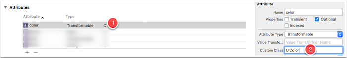
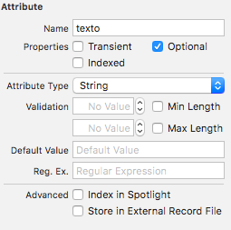

<!-- .slide: class="titulo" -->

# Sesión 5: Más sobre modelos de datos
## Persistencia en dispositivos móviles, iOS


---

## Puntos a tratar

- **Tipos de datos genéricos. Valores *transformables***
- Validación de atributos
- Ciclo de vida de un objeto gestionado
- Deshacer y rehacer operaciones


---

## Tipos de datos para atributos


Por defecto, un atributo solo puede tener tipo *date*, *string*, numérico entero (con diversos tamaños) o numérico real. Pero hay otros dos tipos adicionales: *binary data* (`NSData`) y **transformable**

---

## Valores transformables

- **Se serializan** a binario para almacenarse en la BD. Para poder hacer esto, Core Data tiene que saber cómo serializarlos
- Recordemos de la primera sesión que **en iOS hay un mecanismo estándar de serialización**, el *archiving*, o *coding*. Las clases "serializables" son conformes al protocolo `Codable` (en versiones anteriores de Swift, `NSCoding`)
- Si la clase del atributo es conforme a `NSCoding`, el  proceso será automático

---

## Ejemplo: atributo que sea un color

Supongamos una entidad `Figura` con un atributo `color`. En iOS los colores de la interfaz se representan con `UIColor`, que afortunadamente es conforme a `NSCoding`

---

## ¿Qué hay que hacer en Xcode?

En el editor del modelo de datos, simplemente definir el tipo como `transformable` y el Custom class como `UIColor`



**En este caso particular**, la clase generada automáticamente por Xcode no tiene el `import UIKit` necesario para que compile, por lo que nos tocaría **usar la generación manual de código**

---

- Tipos de datos genéricos. Valores *transformables*
- **Validación de atributos**
- Ciclo de vida de un objeto gestionado
- Deshacer y rehacer operaciones

---

En el editor del modelo se pueden especificar condiciones de validación, que varían según el tipo de dato:



---

**IMPORTANTE** en memoria puede haber atributos no válidos sin problema. La validación solo se hace al guardar el contexto

```swift
...
let usuario = Usuario(context: miContexto)
usuario.login = "pepe"
//Tenemos una regla que dice que la longitud mínima del password es 6
//Pero esta instrucción no fallaría
usuario.password = "pepe"
do {
  //Al intentar guardar falla la validación y genera una excepción  
  try miContexto.save()
} catch let error as NSError {
   if error.code==NSValidationStringTooShortError {
       print("Campo demasiado corto")
   }
}
```

---

## Validaciones propias 

Si queremos validar algo que no está contemplado en el editor visual, debemos implementar un método `validate<nombre_del_atributo>` 


```swift
//Ejemplo: comprobar que la fecha de un mensaje no está en el futuro
public func validateFecha(value: AutoreleasingUnsafeMutablePointer<AnyObject?>) throws {
    let fecha = value.memory as! Date
    if (fecha.timeIntervalSinceDate(date:Date())>0) {
        throw propertyValidationErrorForKey("fecha", localizedDescription: "la fecha no es válida")
    }
}
```


---

- Tipos de datos genéricos. Valores *transformables*
- Validación de atributos
- **Ciclo de vida de un objeto gestionado**
- Deshacer y rehacer operaciones

---


## Ciclo de vida de un objeto gestionado

Podemos enterarnos de cuándo:

- Se crea un objeto gestionado: útil para asignar valores por defecto
- Se recupera de la base de datos: para calcular propiedades
- Se guarda en el almacenamiento persistente
- Se borra: útil para liberar memoria
- Se modifican sus atributos: para actualizar la interfaz


---

## Creación/Recuperación 


cuando se crea por primera vez/recupera del almacenamiento persistente, se llama a sus métodos `awakeFromInsert` y `awakeFromFetch`, respectivamente

```swift
//Ejemplo: asignar a un nuevo mensaje la fecha del sistema
//Archivo Mensaje+Custom.swift
import Foundation
import CoreData

extension Mensaje {
    override public func awakeFromInsert() {
        self.fecha = Date() as NSDate
    }
}
```

---

## Notificaciones para observar el ciclo de vida

- Otra posibilidad para observar el ciclo de vida de los objetos gestionados es usar **notificaciones**.

- Si un objeto se inserta, actualiza o borra, emite una notificación de tipo `NSManagedObjectContextObjectsDidChangeNotification`. Más sobre esto en [este tutorial](https://cocoacasts.com/how-to-observe-a-managed-object-context/)

---

## Detectar cambios en los atributos

- Ya vimos el mecanismo para observar cambios en propiedades de objetos: KVO (Key-Value Observing)
- KVO implementa el patrón `observer`: un objeto concreto observa eventos de otro concreto
- KVO es un poco (solo un poco) tedioso de usar en Swift, requiere:
    + Que los objetos participantes hereden de `NSObject`
    + Que la propiedad a observar esté marcada como `dynamic`
- Ambas condiciones las cumplen automáticamente los `NSManagedObject`

---

## Ejemplo de KVO

supongamos un objeto gestionado `usuario`, con una propiedad `password` y queremos saber cuándo cambia


```swift
//decimos que queremos observar al objeto gestionado, en este caso 
//el observador somos nosotros mismos. No siempre tiene que ser así
usuario.addObserver(self, forKeyPath:"password", options: .new, context:nil)
```


```swift
//Este método debe estar implementado siempre en el observador
override func observeValue(forKeyPath keyPath: String?, of object: Any?, change: [NSKeyValueChangeKey : Any]?, context: UnsafeMutableRawPointer?) {
    if keyPath == "password" {
        let nuevoPassword = change?[.newKey]
        print("El nuevo password es \(nuevoPassword)")
    }
}
```

---

- Tipos de datos genéricos. Valores *transformables*
- Validación de atributos
- Ciclo de vida de un objeto gestionado
- **Deshacer y rehacer operaciones**

---

En el contexto de persistencia hay un **undo manager** que se encarga automáticamente de deshacer y rehacer operaciones. Por defecto no está instanciado, hay que hacerlo al inicializar el *stack* de Core Data:

```swift
//En el AppDelegate, si estamos usando Core Data
 lazy var persistentContainer: NSPersistentContainer = {
     ...
     //Inicializar un undo manager, ya que por defecto era nil
     container.viewContext.undoManager = UndoManager()
     //Esto ya estaba
     return container
}
```

---

Deshacer una operación de Core Data es tan sencillo como 

```swift
//suponiendo que hayamos obtenido el contexto
let miContexto = ...
//deshacemos la última operación realizada
miContexto.undoManager.undo()
```

Por defecto se deshacen todas las operaciones realizadas la última vez que  el sistema “cedió el control” a la aplicación y la app volvió a “pasarle el testigo” al sistema.

Llamando a `beginUndoGrouping` y `endUndoGrouping` podemos establecer manualmente qué deshace el último *undo*