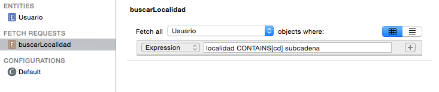

<!-- .slide: class="titulo" -->

# Sesión 6: Búsquedas en Core Data
## Persistencia en dispositivos móviles, iOS


---

## Puntos a tratar

- **Predicados y *fetch requests***
- Predicados como cadenas
- *Fetch request templates*
- Ordenación

---

## Fetch requests

**Predicados**: condiciones para filtrar los resultados de una *fetch request*. Como el `WHERE` de SQL.

```swift
let miDelegate = UIApplication.shared.delegate as! AppDelegate 
let miContexto = miDelegate.persistentContainer.viewContext
let request = NSFetchRequest<Mensaje>(entityName: "Mensaje")
let pred = NSPredicate(format: "texto CONTAINS 'iOS'")
request.predicate = pred
let resultados = try! miContexto.fetch(request)
print("Hay \(resultados.count) resultados")
for mensaje in resultados {
    print(mensaje.texto!)
}
```

---

## Formas de definir predicados

- **Como una cadena de formato** usando expresiones y operadores del lenguaje de consultas, mezclados con caracteres de formato (al estilo `printf`)

- **Como un *template***: ídem a lo anterior pero podemos usar variables con nombre

- **Por código**: hay un conjunto de clases que representan operadores, expresiones, etc. Componiendo dichas clases construimos un predicado

---

## Puntos a tratar

- Predicados y *fetch requests*
- **Predicados como cadenas**
- *Fetch request templates*
- Ordenación

---

## Predicados como cadenas

- **Ventaja:** fácil de escribir y entender
- **Problema:** los errores de sintaxis se detectan *en tiempo de ejecución*

---

## Operadores

- **Operadores de comparación**: `=` (o `==`) `<`, `>`, `<=`, `!=` …
- **Operadores lógicos**: `AND`, `OR`, `NOT` (o también al estilo C, `&&`, `||`, `!`). 

---

## Operadores (2)

- **Comparación de cadenas**: `BEGINSWITH`, `ENDSWITH`, `CONTAINS`, `LIKE` (como `CONTAINS` pero admite comodines `?` o `*`), `MATCHES` (comprueba si la cadena encaja con una expresión regular en [formato ICU](http://userguide.icu-project.org/strings/regexp))

- Por defecto distinguen mayúsculas/minúsculas y símbolos diacríticos (a-à-á-ä)
- Si después del operador hay un símbolo `[c]` indicamos que no queremos distinguir mayúsculas/minúsculas, y `[d]` ídem con los diacríticos

```swift
localidad CONTAINS[c] 'san'
```

---

## Argumentos y caracteres de formato

- Muy similares a los que se usan en C en el `printf`: `%i` es un entero, `%f` un real, `%@` es un objeto (este no existe en C)

```swift
let buscado = "iOS"
NSPredicate(format: "texto CONTAINS %@ AND fecha<%@", argumentArray: [buscado, Date()])
```


---

## Problema con propiedades dinámicas

- Como hemos visto antes, las cadenas se ponen entre comillas (simples o dobles). El formateo lo tiene en cuenta, pero habrá un problema si ponemos el nombre de una propiedad


```swift
let atributo = "login";
let subcadena = "pep";
let pred = NSPredicate(format:"%@ CONTAINS[c] %@", argumentArray:[atributo, subcadena]);
```

generaría esto, que es incorrecto

```bash
"login" CONTAINS[c] "usu"
```

---

## Especificar propiedades con `%K`


- Solución: usar el carácter de formato `%K` (de *keypath*) para especificar propiedades, no inserta comillas

```swift
let pred = NSPredicate(format:"%K CONTAINS[c] %@", argumentArray:[atributo, subcadena]);
```

---

## Puntos a tratar

- Predicados y *fetch requests*
- Predicados como cadenas
- ***Fetch request templates***
- Ordenación


---


## Fetch request templates


- Son una especie de "consultas predefinidas" que podemos crear en el propio modelo de datos, con el editor visual



- Podemos poner **variables**: nombres con `$`: `$login`, `$cadena_buscada`

---


¡Cuidado con el editor visual! en modo asistente a veces pone más comillas de la cuenta


oops!


---

## Ejecutar una *fetch request template*


```swift
let dictVars = ["cadena":"iOS"]
if let queryTmpl = miModelo.fetchRequestFromTemplate(withName: "textoContiene", substitutionVariables: dictVars) {
    let results = try! miContexto.fetch(queryTmpl) as! [Mensaje]
    print("Hay \(results.count) resultados en la template")
    for mensaje in results {
        print(mensaje.texto!)
    }
}
```

---

## Predicados en relaciones

- Podemos incluir no solo los atributos “simples”, sino también los que representan relaciones 
- **Relaciones "a uno"**:  por ejemplo, buscar todos los mensajes enviados por usuarios cuyo login comience por `m` (usamos la relación `Mensaje`-> `Usuario`)


```swift
let request = NSFetchRequest<Mensaje>(entityName: "Mensaje")
let pred = NSPredicate(format:"usuario.login BEGINSWITH[c] 'm'")
request.predicate = pred
```

---

## Predicados en relaciones (II)

- **Relaciones "a muchos"**: algo más complicado, ya que buscamos en una colección. 
- Operador `ANY` para verificar que algún valor de la colección cumple la condición. 
- Por ejemplo buscar todos los usuarios que han participado en alguna conversación en la última hora:

```swift
let haceUnaHora  = Date(timeIntervalSinceNow: -60*60)
let predicado = NSPredicate(format: "ANY conversaciones.comienzo>%@", argumentArray: [haceUnaHora])
```

---

Podemos usar *subqueries* para comprobar que *todas* las entidades "al otro lado" de una relación cumplen una condición

```swift
let haceUnaHora  = Date(timeIntervalSinceNow: -60*60)
let pred = NSPredicate(format: "(SUBQUERY(conversaciones, $c, 
                       $c.comienzo>%@).@count==0)", argumentArray:[haceUnaHora])

```

---

## Consejo: no abusar de las *fetch requests*


- Core Data nos permite trabajar directamente con el grafo de objetos, **no es necesario ejecutar  *fetch request* constantemente**
- Por ejemplo, si ya tenemos un usuario en memoria y queremos consultar sus conversaciones lo hacemos accediendo directamente a la propiedad `conversaciones`, no haciendo una *fetch request* 
- Las *fetch request* siempre acceden a la BD y por tanto son mucho más lentas que trabajar con objetos que ya están en el contexto


---

## Puntos a tratar

- Predicados y *fetch requests*
- Predicados como cadenas
- *Fetch request templates*
- Predicados como objetos
- **Ordenación**

---

## Ordenación: `NSSortDescriptor`


```swift
let credSort = NSSortDescriptor(key:"creditos", ascending:false)
let loginSort = NSSortDescriptor(key:"login" ascending:true)
miFetchRequest.sortDescriptors = [credSort, loginSort])
```

- Por defecto, para ordenar valores se intenta llamar al método `compare:`, de la clase del atributo usado para ordenar, que implementan la mayoría de clases estándar como `String`, `Date`, ...
- En clases propias se puede usar el inicializador de `NSSortDescriptor` `init(key:ascending:selector:`, donde decimos a qué método hay que llamar para saber si un objeto va antes que otro.

---


# ¿Alguna pregunta?