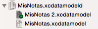
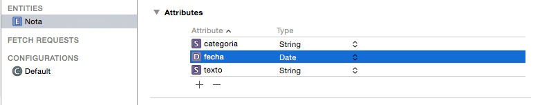
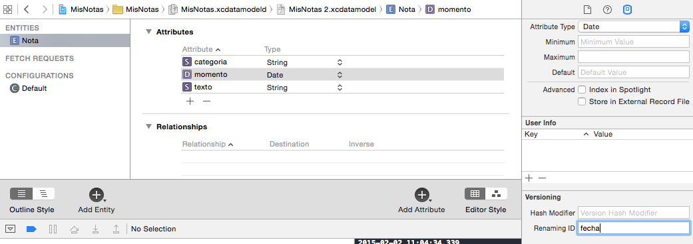
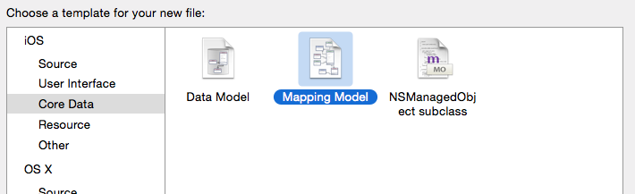
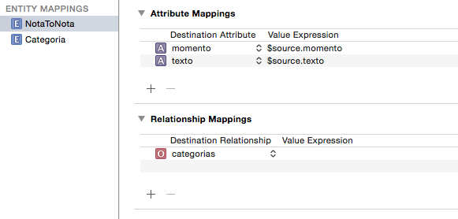
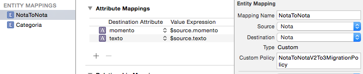

<!-- .slide: class="titulo" --> 

# Migraciones de datos en Core Data
## Persistencia en dispositivos móviles, iOS


---

## Puntos a tratar

- **Migraciones de datos y versiones del modelo**
- Migraciones "ligeras"
- Migraciones "pesadas"


---

## Modificaciones del modelo de datos

- Es normal que durante el desarrollo se vaya **modificando iterativamente el modelo de datos**
- Cuando hay cambios **Core Data modifica automáticamente la estructura de la base de datos**. Pero ¿qué pasa con los datos ya creados?

---

## Migración de datos

- Procedimiento que especifica **cómo transformar los datos de la antigua versión del modelo a la nueva versión**. Si no, los usuarios podrían perder los datos que ya tuvieran.
- Tipos:
  + **"Ligera"**: iOS realiza la transformación de modo automático o semiautomático, según el cambio
  + **"Pesada"**: tenemos que hacerla nosotros, típicamente por código


---

## Gestionar versiones del modelo

- Podemos tener **varias versiones del mismo `.xcdatamodeld`**. Ir a `Editor > Add Model Version...`
- Físicamente son distintos archivos, pero Xcode nos los muestra como un *bundle*



- En cada momento hay una **versión actual** (cambiar en el panel de la derecha)

---


## Puntos a tratar

- Migraciones de datos
- Versiones del modelo
- **Migraciones "ligeras"**
- Migraciones "pesadas"


---

## Migraciones ligeras


- Podemos usarlas si los cambios son
  - Añadir o eliminar un atributo o relación
  - Convertir en opcional un atributo requerido
  - Convertir en requerido un atributo opcional, siempre que se dé un valor por defecto
  - Añadir o eliminar una entidad
  - Renombrar un atributo o relación
  - Renombrar una entidad

---

## Ventajas de las migraciones ligeras

- Son **automáticas**, no requieren escribir código

- Son **rápidas** y requieren pocos recursos computacionales. En el caso de SQLite se ejecutan con comandos del propio SQLite (`ALTER TABLE`,...)

---

## Ejemplo

- En la aplicación de notas, añadir un campo opcional `categoria`





---


## "Activar" la migración

- Cambiar la versión del modelo en Xcode: en el editor del modelo, en el panel de la derecha, seleccionar la versión en el desplegable `Model Version`

- Al arrancar la aplicación, Core Data detecta que el modelo actual no se corresponde con el usado para crear la BD. Desde iOS10, por defecto intenta hacer la migración automáticamente (antes había que "activarla" manualmente)

---

## Migraciones ligeras con cambios de nombre

- Cambiamos el campo "fecha" por "momento". Correspondencia con el nombre antiguo en `renaming ID`



- Gotcha!: en el código debemos **renombrar manualmente**


---

## Puntos a tratar

- Migraciones de datos
- Versiones del modelo
- Migraciones "ligeras"
- **Migraciones "pesadas"**


---

## Migraciones "pesadas"

- Habrá cambios para los que Core Data **no puede inferir automáticamente la transformación**

- Ejemplo: transformar el atributo "categoria" en una entidad


---

<!-- .slide:  data-background-image="http://s3-eu-west-1.amazonaws.com/rankia/images/valoraciones/0007/1876/gandalf-pp-meme-generator-huid-insensatos-huid-877350.png?1339769086" -->


---

## Proceso de una migración "pesada"


- Hay **dos "*stacks*" de Core Data en funcionamiento** (con dos contextos de persistencia): el del modelo antiguo y el del nuevo
- Hay que ir cargando entidad por entidad en memoria e ir convirtiéndolas al "nuevo formato", no se puede hacer en la propia BD

---

## Crear el "mapping model"

- Hay que **crear manualmente** un "mapping model"




- El asistente nos pregunta **de qué versión a qué version** del modelo de datos estamos transformando

---

## El "mapping model"


- Consiste en un conjunto de transformaciones de los objetos "antiguos" a los "nuevos". Se usa el nombre `EntidadAntiguaToEntidadNueva`
- Xcode intenta deducir la transformación. Lo conseguirá para las partes que no cambien demasiado



---

## Migration Policy

- La encargada de efectuar la transformación es la clase `NSEntityMigrationPolicy`

- Para especificar manualmente la política de migración creamos una subclase de `NSEntityMigrationPolicy` y especificamos que queremos usarla para determinada parte de la transformación




---

## Nuestra propia "migration policy"

```swift
import UIKit
import CoreData

class MiMigrationPolicy: NSEntityMigrationPolicy {
    
    override func createDestinationInstances(forSource sInstance: NSManagedObject, in mapping: NSEntityMapping, manager: NSMigrationManager) throws {
        //creamos la nueva entidad
        let nueva = NSEntityDescription.insertNewObject(forEntityName: "Nota", into: manager.destinationContext)

        //Hacemos las operaciones necesarias para transformar la entidad "antigua" en la nueva. 
        //Este código será totalmente distinto según cada caso
        ...

        //Al final le pasamos al manager la entidad nueva resultante
        manager.associate(sourceInstance: notaOrigen, withDestinationInstance: notaDestino, for: mapping)      
    }
}
```

---

## Nuestra propia "migration policy"

```swift
import UIKit
import CoreData

class CrearCategoriasMigrationPolicy: NSEntityMigrationPolicy {
    //instancias de categorías que existen ya
    var categorias : [String : NSManagedObject] = [:]
    
    override func createDestinationInstances(forSource sInstance: NSManagedObject, in mapping: NSEntityMapping, manager: NSMigrationManager) throws {
        let notaOrigen = sInstance as! Nota
        let notaDestino = NSEntityDescription.insertNewObject(forEntityName: "Nota", into: manager.destinationContext) as! Nota
        //copiar propiedades básicas
        notaDestino.contenido = notaOrigen.contenido
        notaDestino.fecha = notaOrigen.fecha
        notaDestino.etiquetas = notaOrigen.etiquetas
        //si la nota tiene una categoría
        if let nombreCategoria = notaOrigen.categoria {
           //miramos si la categoría ya existe como entidad
           var categoria = categorias[nombreCategoria]
           //si no existe, creamos la instancia de la entidad
           if categoria==nil {
              categoria = NSEntityDescription.insertNewObject(forEntityName: "Categoria", into: manager.destinationContext)
              categoria?.setValue(nombreCategoria, forKey: "nombre")
              categorias[nombreCategoria] = categoria
           }
           //asociamos la entidad nota con la entidad categoría
           //como es una relación 1->N es un conjunto por ahora de un único elemento
           var catsDeNota = Set<NSManagedObject>()
           catsDeNota.insert(categoria!)
           notaDestino.setValue(catsDeNota, forKey: "categorias")
        }
        //Al final siempre hay que llamar a este método para establecer una correspondencia
        //entre entidad en el modelo actual y entidad en el nuevo
        manager.associate(sourceInstance: notaOrigen, withDestinationInstance: notaDestino, for: mapping)      
    }
}
```

---

Para configurar las migraciones "pesadas" hay que decirle a Core Data que haga caso de nuestro *mapping model*, que no lo "deduzca" él automáticamente a partir de los modelos

```swift
/En el AppDelegate
//Esta línea queda tal cual, las modificaciones vienen a partir de ella
//CUIDADO: el name cambia, según el nombre del proyecto
let container = NSPersistentContainer(name: "PruebaMigraciones")

let urls = FileManager.default.urls(for: .applicationSupportDirectory, in: .userDomainMask)
//CUIDADO: la cadena cambia, según el nombre del proyecto
let urlBD = urls[0].appendingPathComponent("PruebaMigraciones.sqlite")
let psd = NSPersistentStoreDescription(url: urlBD)
//que no se intente automatizar la migración
psd.shouldInferMappingModelAutomatically = false
psd.type = NSSQLiteStoreType

container.persistentStoreDescriptions = [psd]
```

---


# ¿Alguna pregunta?