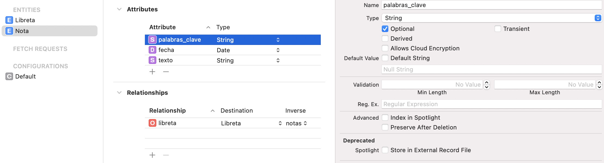
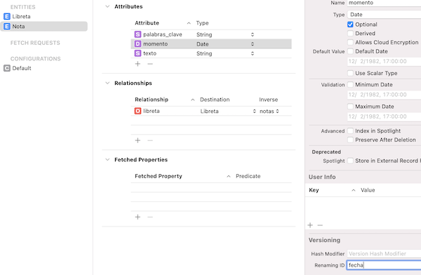
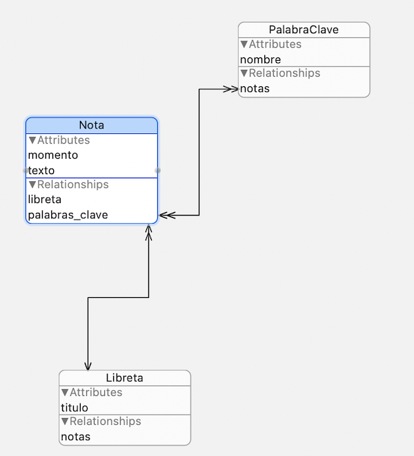

<!-- .slide: class="titulo" --> 

# Migraciones de datos en Core Data
## Persistencia en dispositivos móviles, iOS

---

## Puntos a tratar

- **Migraciones de datos y versiones del modelo**
- Migraciones "ligeras"
- Migraciones "pesadas"

---

## Modificaciones del modelo de datos

- Es normal que durante el desarrollo se vaya **modificando iterativamente el modelo de datos**
- Cuando hay cambios **Core Data modifica automáticamente la estructura de la base de datos**. Pero ¿qué pasa con los datos ya creados?

---

## Migración de datos

- Procedimiento que especifica **cómo transformar los datos de la antigua versión del modelo a la nueva versión**. Si no, los usuarios podrían perder los datos que ya tuvieran.
- Tipos:
  + **"Ligera"**: iOS realiza la transformación de modo automático o semiautomático, según el cambio
  + **"Pesada"**: tenemos que hacerla nosotros, típicamente por código

---

## Gestionar versiones del modelo

- Podemos tener **varias versiones del mismo `.xcdatamodeld`**. Ir a `Editor > Add Model Version...`
- Físicamente son distintos archivos, pero Xcode nos los muestra como un *bundle*

- En cada momento hay una **versión actual** (cambiar en el panel de la derecha)

---

## Puntos a tratar

- Migraciones de datos
- Versiones del modelo
- **Migraciones "ligeras"**
- Migraciones "pesadas"

---

## Migraciones ligeras

- Podemos usarlas si los cambios son
  - Añadir o eliminar un atributo o relación
  - Convertir en opcional un atributo requerido
  - Convertir en requerido un atributo opcional, siempre que se dé un valor por defecto
  - Añadir o eliminar una entidad
  - Renombrar un atributo o relación
  - Renombrar una entidad

---

## Ventajas de las migraciones ligeras

- Son **automáticas**, no requieren escribir código

- Son **rápidas** y requieren pocos recursos computacionales. En el caso de SQLite se ejecutan con comandos del propio SQLite (`ALTER TABLE`,...)

---

## Ejemplo

- En la aplicación de notas, añadir un campo opcional `palabras_clave` (para simplificar un `String` que es una lista de palabras clave separadas por espacios)

---

## "Activar" la migración

- Cambiar la versión del modelo en Xcode: en el editor del modelo, en el panel de la derecha, seleccionar la versión en el desplegable `Model Version`

- Al arrancar la aplicación, Core Data detecta que el modelo actual no se corresponde con el usado para crear la BD. Desde iOS10, por defecto intenta hacer la migración automáticamente (antes había que "activarla" manualmente)

---

## Migraciones ligeras con cambios de nombre

- Ejemplo: cambiamos el campo "fecha" por "momento". 
- Poner el nombre antiguo en `renaming ID`
- Xcode puede hacer un *refactor* automático para renombrar la propiedad en los fuentes 

 <!-- .element: class="r-stretch" -->

---

## Puntos a tratar

- Migraciones de datos
- Versiones del modelo
- Migraciones "ligeras"
- **Migraciones "pesadas"**

---

## Migraciones "pesadas"

- Habrá cambios para los que Core Data **no puede inferir automáticamente la transformación**
- Ejemplo: transformar el atributo "palabras_clave" en una entidad

---

<!-- .slide:  data-background-image="http://s3-eu-west-1.amazonaws.com/rankia/images/valoraciones/0007/1876/gandalf-pp-meme-generator-huid-insensatos-huid-877350.png?1339769086" -->

---

## Proceso de una migración "pesada"

- Hay **dos "*stacks*" de Core Data en funcionamiento** (con dos contextos de persistencia): el del modelo antiguo y el del nuevo
- Hay que ir cargando entidad por entidad en memoria e ir convirtiéndolas al "nuevo formato", no se puede hacer en la propia BD
- La transformación se hace mediante un "mapping model" en el que típicamente por código se define cómo crear las nuevas entidades a partir de las antiguas
- En los apuntes tenéis un ejemplo 

---

# ¿Alguna pregunta?