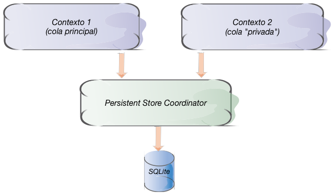
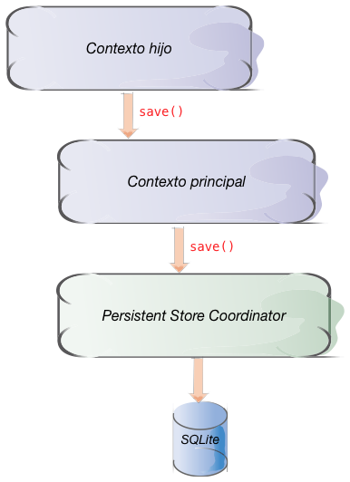

<!-- .slide: class="titulo" --> 
 
# Concurrencia y contextos múltiples en Core Data
## Persistencia en dispositivos móviles


---

## Puntos a tratar

- Por qué contextos múltiples
- Contextos para trabajos en *background*
- Comunicación entre contextos
- Contextos anidados

---

## Puntos a tratar

- **Por qué contextos múltiples**
- Contextos para trabajos en *background*
- Comunicación entre contextos
- Contextos anidados

---

## Aplicaciones que necesitan concurrencia

- Nuestro código normalmente se ejecuta en el mismo *thread* que la interfaz de usuario. **Si realizamos una operación costosa con Core Data la interfaz se bloqueará**.
- La solución es realizar estas operaciones en otro *thread*. Como el API de *threading* es de bajo nivel, mejor usar *colas de operaciones*, una abstracción mucho más amigable (o alternativamente *grand central dispatch*)

```swift
let background = OperationQueue();
background.addOperation() {
    print("Comienzo mi duro trabajo...")
    sleep(4)
    print("...terminado!")
    print("pero yo no puedo tocar la interfaz")
    OperationQueue.main.addOperation() {
        print("Soy main. Desde aquí se puede actualizar la interfaz")
    }
}
```

---

## Multi-threading y Core Data

- Por desgracia ni los objetos gestionados ni el contexto de persistencia son *thread-safe*, no debemos operar con ellos desde distintos *threads*
- Solución:
   * Creamos varios contextos
   * **Cada contexto trabaja en su propio *thread***



---

- El **contexto principal** es adecuado para pintar en pantalla los datos, recordad que el hilo principal es el único que debe pintar en pantalla
  + Este es el que veníamos usando hasta ahora todo el tiempo, es el que crea la plantilla de Xcode por defecto
- Los **contextos secundarios** son apropiados para por ejemplo hacer operaciones costosas, pero no deben pintar en pantalla


---

## Código

En teoría crearíamos tantos contextos como necesitáramos

```swift
//Crear un contexto asociado a la cola de operaciones principal
//ADECUADO PARA PINTAR DATOS EN PANTALLA
let contexto = NSManagedObjectContext(concurrencyType: .mainQueueConcurrencyType)
//Crear un contexto asociado a una nueva cola de operaciones
//ADECUADO POR EJEMPLO PARA OPERACIONES COSTOSAS
let contexto2 = NSManagedObjectContext(concurrencyType: .privateQueueConcurrencyType)
```

En realidad no va a hacer falta crear explícitamente los contextos, hay métodos auxiliares **más simples de usar** y por tanto los usaremos


---

## Puntos a tratar

- Por qué contextos múltiples
- **Contextos para trabajos en *background***
- Comunicación entre contextos
- Contextos anidados

---

## Múltiples contextos para *background*

El caso de uso más típico para los múltiples contextos es un contexto adicional asociado a una nueva cola desde el que hacemos las operaciones costosas. Así no bloqueamos la interfaz.

Es tan típico que desde iOS10 el `NSPersistentContainer` tiene un API especial para esto: `performBackgroundTask`

```swift
let miDelegate = UIApplication.shared.delegate as! AppDelegate
//creamos un nuevo contexto secundario y ejecutamos en él el siguiente código
miDelegate.persistentContainer.performBackgroundTask() {
   //el nuevo contexto
   contextoBG in
    let request = NSFetchRequest<Nota>(entityName: "Nota")  
    let lista = try! contextoBG.fetch(request)
    for nota in lista {
        //Aquí hacemos una operación costosa, como exportar cada nota a PDF
        //o subirlas a un servidor
    }
}
```

---

## Múltiples contextos para *background* (II)


- También podemos pedirle al *persistent container* explícitamente un nuevo contexto de *background*, es decir, asociado a un *thread/cola* secundario(a)

```swift
let miDelegate = UIApplication.shared.delegate as! AppDelegate
let contextoBG = miDelegate.persistentContainer.newBackgroundContext()
```

---

## Múltiples contextos para *background* (III)


Una vez creado el contexto de *background*, para ejecutar una operación en él se usa `perform` (asíncrono) o `performAndWait` (síncrono)

```swift
let miDelegate = UIApplication.shared.delegate as! AppDelegate
let contextoBG = miDelegate.persistentContainer.newBackgroundContext()
...
contextoBG.perform() {
   //Aquí vendría la operación costosa
   ...
}
```

Es decir, el `performBackgroundTask` de antes es como un `newBackgroundContext` seguido de un `perform`

---

## Puntos a tratar

- Por qué contextos múltiples
- Contextos para trabajos en *background*
- **Comunicación entre contextos**
- Contextos anidados

---

Supongamos una *app* en la que tenemos una búsqueda/recuperación de datos muy costosa, y la hacemos en un contexto asociado a una nueva cola de operaciones (*background*). **Cuando recuperamos los datos, los obtenemos en otro contexto**, ¿cómo los mostramos/editamos/borramos desde el contexto principal?

Importante: **los objetos gestionados no se deben compartir directamente entre contextos**. Cada objeto gestionado está asociado al contexto en que "nació"

<!-- 
---

## Pasar objetos entre contextos con el identificador

- Cada objeto persistente tiene un identificador único (propiedad `objectID`).**El id es único también entre contextos**
- Es sencillo recuperar un objeto a partir de su id: método `object(with:)`

Solución: desde el hilo secundario le pasamos al principal un array con los `id` de los objetos, y los "re-materializamos" con `object` en el hilo principal

---

```swift
let resultados : [NSManagedObject]!
let miDelegate = UIApplication.shared.delegate as! AppDelegate
miDelegate.persistentContainer.performBackgroundTask() {
  contextoBG in
  let request = NSFetchRequest<Nota>()
  let resultadosBG = try! contextoBG.fetch(request)
  let ids = resultadosBG.map { $0.objectID }
  miContexto.perform() {
    self.resultados = ids.map {miContexto.object(with:$0)}
    //ahora nos aseguraríamos de que se pintaran los resultados
    ...
  }
}
```
-->


---


## Pasar objetos entre contextos sincronizando

- Recordemos que cuando un objeto persistente se guarda, emite una notificación
- Esta notificación se puede escuchar desde cualquier hilo
- El método `mergeChanges` *refresca* un contexto actualizándolo con la información contenida en la notificación


---

```swift
let miDelegate = UIApplication.shared.delegate as! AppDelegate
//El contexto principal, como hasta ahora
let miContexto = miDelegate.persistentContainer.viewContext
//Un contexto secundario
let contextoBg = miDelegate.persistentContainer.newBackgroundContext()
//El "notification center" de la aplicación
let nc = NotificationCenter.default
//Cuando el contextoBg emita una notificación de este tipo, ejecutamos el código
nc.addObserver(forName: .NSManagedObjectContextDidSave,
               object: contextoBg,
               queue: nil) {
     notificacion in
       miContexto.mergeChanges(fromContextDidSave: notificacion)
}
```


---

## Puntos a tratar

- Por qué contextos múltiples
- Contextos para trabajos en *background*
- Comunicación entre contextos
- **Contextos anidados**

---

## Contextos anidados

- Como ya hemos visto, normalmente el contexto de persistencia está conectado con el *persistent store coordinator*, y este "gestiona la BD".

- Desde iOS5 se pueden crear contextos conectados a otros (hijos/padres). Cuando el hijo hace `save` se lo enviamos al padre, pero hasta que este no hace `save` el objeto no se hace persistente

---



---

```swift
let contextoPadre = NSManagedObjectContext(concurrencyType: .mainQueueConcurrencyType)
//El padre está conectado a un "persistent store coordinator"
contextoPadre.persistentStoreCoordinator = ...
let contextoHijo = NSManagedObjectContext(concurrencyType: .mainQueueConcurrencyType)
//El hijo está conectado al padre
contextoHijo.parent = contextoPadre
```


---


## Contextos anidados para "modo borrador"

- Supongamos una pantalla de la *app* donde podamos hacer muchos cambios, y donde queremos que el usuario pueda cancelar
- Creamos un contexto hijo y hacemos las operaciones en él. Si el usuario le da a *guardar*, hacemos `save()` del padre. Si le da a cancelar, simplemente no hacemos nada. Se perderá el contexto hijo y con él los cambios

---

## Contextos anidados para almacenar en *background*

Alternativa al método que vimos al principio.

- Tenemos un contexto hijo en la cola principal y el padre en una cola aparte
- Trabajamos habitualmente en el contexto hijo
- Las operaciones de guardado en el hijo no serán costosas ya que `save()` del hijo solo guardará en memoria. El `save()` del padre se hace en *background* y por tanto tampoco paraliza la UI

---


# ¿Alguna pregunta?